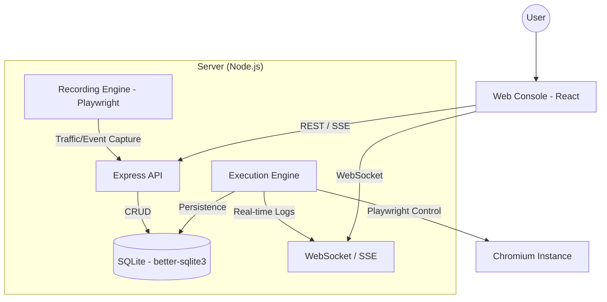

# QuantumQA Architecture Documentation

QuantumQA is a unified E2E testing framework designed for deterministic UI and API automation. It follows a decoupled Client-Server architecture with a shared contract layer.

---

## 1. System Overview

QuantumQA is built as a monolithic repository that integrates a React-based management console with a robust Node.js execution engine.

- **Frontend**: React 19, Vite, Lucide, TailwindCSS (for internal styling).
- **Backend**: Express 5, Better-SQLite3, Playwright.
- **Shared**: Centralized TypeScript interfaces and contracts.

### Architecture Diagram

---

## 2. Server-Side Architecture

The server is the core of the platform, managing data persistence, test orchestration, and automation control.

### Module Pattern
The server follows a modular architecture where each feature (e.g., `projects`, `suites`, `execution`) is self-contained:
- `router.ts`: Express routes.
- `repository.ts`: Data access layer using `better-sqlite3`.
- `mapper.ts`: Transformation between DB rows and shared contracts.

### Database Layer
- **Persistence**: A single `database.sqlite` file manages all test definitions, elements, and reports.
- **Migrations**: Automated migration system located in `server/migrations/` ensures schema consistency across updates.
- **Repository Pattern**: Abstracted CRUD operations ensure that business logic remains decoupled from SQL queries.

---

## 3. The Execution Engine

The Execution Engine is a deterministic state machine that processes test plans through several layers of abstraction.

### Layered Variable Scoping (`ExecutionContext`)
Variable resolution follows a strict priority hierarchy (from lowest to highest):
1.  **DYNAMIC**: Project-level generators.
2.  **ENVIRONMENT**: Global constants (BASE_URL).
3.  **SUITE**: Suite-level defaults.
4.  **SCENARIO**: Scenario-wide overrides and data-driven rows.
5.  **CASE**: Runtime-extracted variables (highest priority).

### The Interpolation Engine
The `interpolator.ts` resolves templates like `{{auth_token}}` or `{{$uuid()}}`.
- **Generators**: Prefixed with `$` (e.g., `$timestamp`, `$randomInt`).
- **Transformers**: Pipe-based mutations (e.g., `| base64`, `| jsonPath("$.id")`).
- **Resolution Depth**: Supports up to 20 levels of nested module calls.

### UI & API Executors
- **UI Executor**: Wraps Playwright to perform browser actions. It uses a "Selector Resiliency" strategy, attempting multiple locators (TEST_ID > ARIA > CSS) to ensure stability.
- **API Executor**: A native fetch-based runner with integrated assertion and extraction logic. It automatically resolves environment-based Base URLs.

---

## 4. The Recording Engine

Recording is split into two synchronized workflows:

1.  **UI Event Tracking**:
    -   Injects a JavaScript tracker into the target page.
    -   Captures clicks, inputs, and scrolls.
    -   Sends "Optimal Selectors" back to the server via API.
2.  **Network Interception**:
    -   Uses Playwright's `page.on('request')` to sniff background traffic.
    -   Filters traffic by domain to automatically create API Endpoints, Header Profiles, and Body Templates.

---

## 5. Client-Side Architecture

The frontend is a modern SPA designed for high productivity.

- **Feature-Based Structure**: Logic is grouped by feature (e.g., `client/features/tests`).
- **Unified Services**: `api.ts` provides a strongly typed CrudService factory for all server resources.
- **Real-time Feedback**:
    -   **SSE (Server-Sent Events)**: Used for streaming logs from the execution engine to the console.
    -   **WebSockets**: Used for light, real-time updates (e.g., element discovery during recording).

---

## 6. Communication Protocols

| Protocol | Usage |
| :--- | :--- |
| **REST API** | Primary CRUD operations and configuration management. |
| **SSE** | Real-time logs and progress updates during test execution. |
| **WebSocket** | Real-time notifications and recording engine callbacks. |
| **JSON** | Standard data exchange format for all interfaces. |

---

## 7. Deployment & Environment

QuantumQA is designed to run in diverse environments:
- **Development**:vite-middleware integrated into Express allowed for a "single command" startup (`npm run dev`).
- **Production**: esbuild bundles the server, and Vite builds the client into static assets served by Express.
- **Isolation**: Each execution run gets a fresh Playwright BrowserContext to ensure zero state leakage between tests.
