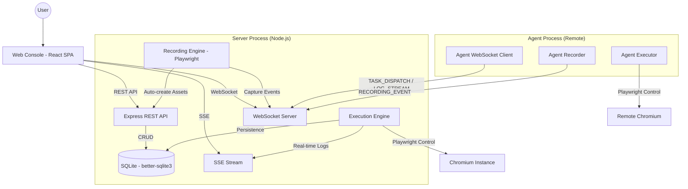
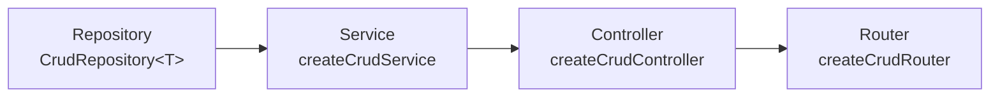
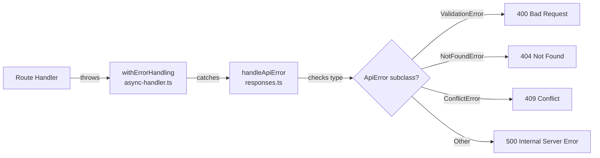
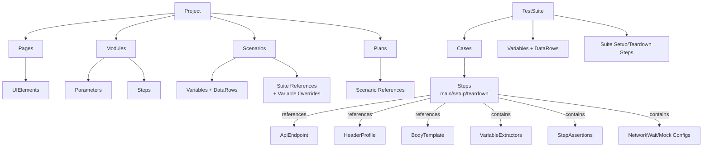
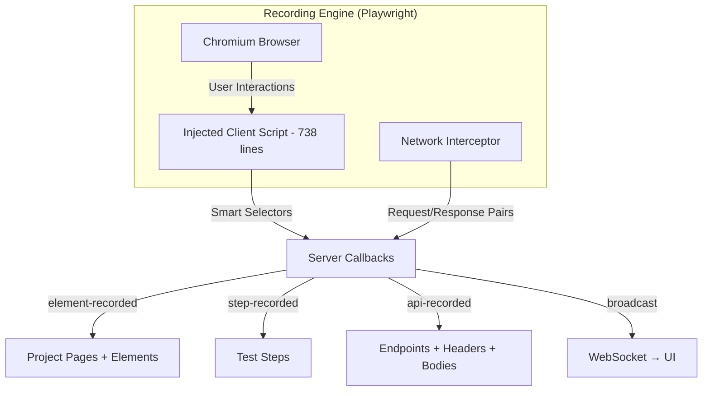
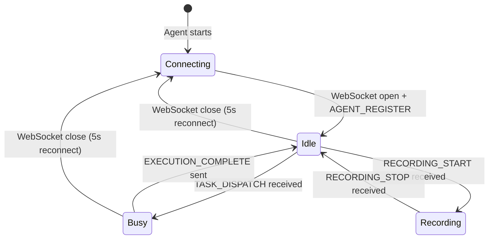
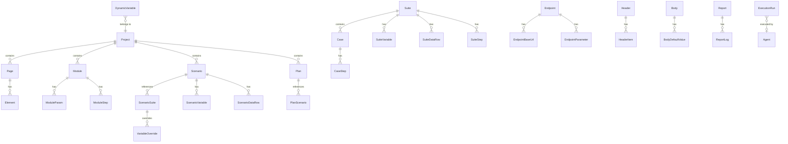

# QuantumQA Architecture Documentation

QuantumQA is a unified E2E testing platform designed for deterministic UI and API automation. It follows a **Modular Monolith** architecture with a shared contract layer bridging client, server, and remote agent processes.

---

## 1. System Overview

QuantumQA is built as a monolithic repository that integrates a React-based management console with a Node.js execution engine and a distributed agent system.

### Technology Stack

| Layer | Technology |
| :--- | :--- |
| **Frontend** | React 19, Vite 6, Lucide Icons, TailwindCSS |
| **Backend** | Express 5, Better-SQLite3, tsx (dev), esbuild (build) |
| **Automation** | Playwright (Chromium) |
| **Validation** | Zod 4 |
| **Real-time** | WebSocket (ws), Server-Sent Events (SSE) |
| **Persistence** | SQLite (local file: `database.sqlite`) |
| **Language** | TypeScript 5.8 (ES2022 target) |

### Architecture Diagram



---

## 2. Directory Structure

```
e2e_test/
├── agent/                    # Remote agent process (separate Node.js process)
│   ├── index.ts              # Agent entry point: WebSocket connection, task dispatch, execution
│   ├── AgentLogger.ts        # Streams execution logs back to server via WebSocket
│   ├── recording.ts          # Recording session adapter for remote agent
│   └── .env.example          # Agent configuration template
│
├── client/                   # React SPA frontend
│   ├── index.tsx             # App entry, Vite root
│   ├── types.ts              # Top-level client type aliases
│   ├── app/                  # App shell (navigation, layout, global hooks)
│   │   ├── App.tsx           # Root component with routing
│   │   ├── navigation.ts     # Route definitions
│   │   ├── types.ts          # App-level types
│   │   ├── components/       # Shell components (Sidebar, Header, Modal, Toast, etc.)
│   │   └── hooks/            # useProjectScope, useWorkspaceSelection
│   ├── features/             # Feature modules (one per domain)
│   │   ├── agents/           # Agent management UI
│   │   ├── api-assets/       # Endpoints, Headers, Bodies management
│   │   ├── dashboard/        # Dashboard overview
│   │   ├── documentation/    # In-app documentation viewer
│   │   ├── dynamic-variables/# Dynamic variable management
│   │   ├── elements/         # Page Object Model / Element Repository
│   │   ├── execution/        # Test execution panel with SSE log streaming
│   │   ├── modules/          # Reusable module management
│   │   ├── reports/          # Execution report viewer
│   │   ├── settings/         # Global settings
│   │   └── tests/            # Suite/Case authoring and scenario/plan management
│   └── shared/               # Cross-feature shared code
│       ├── types.ts          # Client-side domain type definitions
│       ├── services/api.ts   # Typed REST API client + CrudService factory
│       ├── hooks/            # useCrud, useApiState
│       ├── ui/               # Reusable UI components (Button, Input, Table, etc.)
│       ├── execution/        # Execution-specific shared components (StepList, LogViewer)
│       └── testing/          # Test-specific shared components
│
├── server/                   # Node.js backend
│   ├── index.ts              # Server entry point (loads .env, starts server)
│   ├── migrate.ts            # Standalone CLI migration runner
│   ├── seed.ts               # Database seeder (demo data)
│   ├── app/                  # Application factory
│   │   ├── createApp.ts      # Express app setup: CORS, JSON, migrations, routes
│   │   ├── registerRoutes.ts # Registers all module routers at their base paths
│   │   └── startServer.ts    # HTTP server start, Vite middleware, WebSocket init
│   ├── migrations/           # Database migrations (001-009)
│   │   ├── index.ts          # Migration runner (auto-applies pending migrations)
│   │   ├── types.ts          # Migration type definition
│   │   ├── 001_initial_schema.ts  # Full initial schema (25+ tables)
│   │   ├── 002-009_*.ts      # Incremental schema enhancements
│   │   ├── seed.ts           # Seed data loader
│   │   └── seed_data.json    # Demo project data
│   ├── modules/              # Domain modules (feature-based)
│   │   ├── agent/            # Agent lifecycle, registry, dispatch, bundler
│   │   ├── bodies/           # Body template CRUD
│   │   ├── common/           # Cross-module mappers (normalizeStep, deserializeStep)
│   │   ├── dynamic-variables/# Dynamic variable management + preview
│   │   ├── endpoints/        # API endpoint CRUD
│   │   ├── environments/     # Environment + variable management
│   │   ├── execution/        # Test execution runner, queue, context, interpolator, assertions
│   │   ├── headers/          # Header profile CRUD
│   │   ├── projects/         # Project CRUD (pages, elements, modules, scenarios, plans)
│   │   ├── recording/        # Interactive UI + API recording via Playwright
│   │   ├── reports/          # Execution report CRUD
│   │   ├── settings/         # Global settings CRUD
│   │   └── suites/           # Test suite CRUD (cases, steps, variables, data rows)
│   └── shared/               # Server-side shared infrastructure
│       ├── contracts/        # Re-export of shared/contracts (domain types)
│       ├── core/             # Re-export of shared/core/executor
│       ├── db/               # SQLite client singleton + DB row types
│       ├── http/             # CRUD factory, error classes, async handler, responses
│       ├── services/         # WebSocket service (agent + recording + broadcast)
│       ├── utils/            # ID generation, type coercion, normalization helpers
│       └── validation/       # Zod validateWithSchema + shared schemas
│
├── shared/                   # Cross-process shared code (server + agent + client)
│   ├── contracts/index.ts    # Single source of truth for all domain types
│   ├── core/executor.ts      # Core execution engine (shared by server + agent)
│   └── constants/agent.ts    # Agent version constant
│
├── docs/                     # Documentation
├── dist/                     # Build output
├── Dockerfile                # Multi-stage Docker build
├── vite.config.ts            # Vite config with @/ alias for client/
├── tsconfig.json             # TypeScript config (ES2022, React JSX, bundler resolution)
└── package.json              # Project manifest (quantum-qa-matrix)
```

---

## 3. Server-Side Architecture

### 3.1 Application Bootstrap

The server follows a clear initialization chain:

```
server/index.ts
  └── startServer()                    # server/app/startServer.ts
        ├── runMigrations()            # server/migrations/index.ts
        ├── createApp()                # server/app/createApp.ts
        │     ├── express()            # Create Express instance
        │     ├── cors() + json()      # Global middleware
        │     ├── runMigrations()      # (Note: called redundantly here too)
        │     └── registerRoutes(app)  # server/app/registerRoutes.ts
        │           └── app.use(module.basePath, module.router)  × 12 modules
        ├── Vite middleware (dev) / Static serving (prod)
        ├── http.listen(port)
        └── initializeWebSocket(server)
```

### 3.2 Module Pattern

The server uses a **modular monolith** pattern. Each domain module is self-contained and exports a standard interface:

```typescript
export const myModule = { basePath: '/api/my-resource', router };
```

Modules are registered in a single array in `registerRoutes.ts`, making it trivial to add new modules.

#### CRUD Data Module Pattern (8 of 13 modules)

Most data modules follow an identical 4-file pattern:

| File | Responsibility |
| :--- | :--- |
| `schema.ts` | Zod validation schemas for create/update payloads |
| `repository.ts` | SQLite persistence (save/get/list/remove) conforming to `CrudRepository<T>` |
| `mapper.ts` | Normalization function converting `Partial<T>` → `T` with safe defaults |
| `index.ts` | Wires: Repository + Mapper → CrudService → CrudController → CrudRouter |

The wiring in `index.ts` is formulaic:

```typescript
const baseService = createCrudService({ repository, normalize });
const service = {
  ...baseService,
  create: (p) => baseService.create(validateWithSchema(payloadSchema, p)),
  update: (id, p) => baseService.update(id, validateWithSchema(patchSchema, p)),
};
const controller = createCrudController(service);
const router = createCrudRouter(controller);
export const module = { basePath: '/api/...', router };
```

This produces standard REST endpoints: `GET /`, `GET /:id`, `POST /`, `PATCH /:id`, `DELETE /:id`.

#### CRUD Factory Stack

The `server/shared/http/crud.ts` provides a 3-layer factory:



- **Repository**: `list()`, `get(id)`, `save(item)`, `remove(id)` — direct SQLite access
- **Service**: Adds conflict detection (409 on duplicate), not-found checks (404), normalization
- **Controller**: Maps Express `Request/Response` to service calls, returns JSON with HTTP status codes

#### Custom Router Modules (non-CRUD)

4 modules use custom routers due to complex logic:

| Module | Reason |
| :--- | :--- |
| **agent** | WebSocket lifecycle management, SSE log streaming, agent package download |
| **execution** | SSE streaming, task queue, abort support, multi-granularity dispatch |
| **recording** | Playwright browser lifecycle, WebSocket broadcasting of recorded events |
| **dynamic-variables** | Nested REST routes under projects, preview endpoint using interpolator |

### 3.3 Shared Infrastructure Layer

| Module | File | Purpose |
| :--- | :--- | :--- |
| **Database** | `shared/db/client.ts` | SQLite singleton with corruption recovery |
| **DB Types** | `shared/db/types.ts` | 17 row type definitions matching SQL schema |
| **HTTP Errors** | `shared/http/errors.ts` | `ApiError` hierarchy: `ValidationError(400)`, `NotFoundError(404)`, `ConflictError(409)` |
| **HTTP Responses** | `shared/http/responses.ts` | `handleApiError()` — maps error classes to HTTP status codes |
| **Async Handler** | `shared/http/async-handler.ts` | `withErrorHandling()` — wraps route handlers with try/catch |
| **Validation** | `shared/validation/validate.ts` | `validateWithSchema()` — Zod parse + throw `ValidationError` |
| **Validation Schemas** | `shared/validation/schemas.ts` | Shared Zod schemas for steps, extractors, assertions, dynamic variables |
| **Utils** | `shared/utils/index.ts` | `WithId` type, `randomId()`, `asText()`, `asId()`, `asArray()`, `nullableText()` |
| **WebSocket** | `shared/services/websocketService.ts` | WebSocket server init, agent management, recording events, broadcast |

### 3.4 Error Handling Pipeline



### 3.5 Domain Module Details

#### Projects Module (`/api/projects`)

The **root entity** of the domain model. A project contains:
- **Pages** with **UIElements** (Page Object Model)
- **Modules** with **Parameters** and **Steps** (reusable step groups)
- **Scenarios** with **variable overrides**, **data rows**, and **suite references**
- **Plans** with ordered **scenario references**

Repository writes to 10+ tables in a single transaction. The most complex persistence logic in the system.

#### Suites Module (`/api/suites`)

The **primary test authoring unit**. A suite contains:
- **Cases** with **steps** (main, setup, teardown)
- **Variables** (key-value pairs)
- **Data rows** (for data-driven testing)
- **Setup/teardown steps** (suite-level)

Repository writes to 6+ tables in a transaction.

#### Execution Module (`/api/runners`)

The **central nervous system** — orchestrates test runs at all granularity levels.

| File | Role |
| :--- | :--- |
| `runner.ts` | Orchestrator: loads all assets, builds `TaskPayload`, dispatches locally or remotely |
| `queue.ts` | `TaskQueue` (EventEmitter-based): targeted, label-based, or any-agent dispatch |
| `context.ts` | `ExecutionContext`: 13-layer variable resolution chain |
| `interpolator.ts` | Template engine: `{{var}}`, generators (`$uuid()`), transformers (`\| base64`) |
| `api-executor.ts` | HTTP API step runner: resolves endpoints, headers, bodies; executes fetch; evaluates assertions/extractors |
| `assertions.ts` | Evaluates assertions: EQUALS, NOT_EQUALS, CONTAINS, EXISTS, MATCHES_REGEX, etc. |
| `logger.ts` | `ExecutionLogger`: dual-channel (SSE + in-memory) log management |

#### Agent Module (`/api/agents`)

The **remote execution backbone**:

| File | Role |
| :--- | :--- |
| `repository.ts` | SQLite CRUD for `agents` table |
| `registry.ts` | In-memory `AgentRegistry`: tracks active WebSocket connections |
| `dispatcher.ts` | Task dispatch with EventEmitter signals (complete/reject/timeout), 1-hour timeout |
| `log-buffer.ts` | Per-agent ring buffer (500 lines) with SSE fan-out for live log streaming |
| `agent-bundler.ts` | Generates ZIP package: agent.js bundle + config + scripts |

#### Recording Module (`/api/recording`)

The **authoring pipeline** — captures UI interactions and API traffic:

| File | Role |
| :--- | :--- |
| `routes.ts` | `POST /start` and `POST /stop` endpoints; 3 callback processors (element/step/API recorder) |
| `engine.ts` | Playwright-based engine: injects 738-line client script for smart selector generation (getByRole > getByTestId > CSS ID > getByText) |

---

## 4. Shared Contract Layer

The `shared/contracts/index.ts` file is the **single source of truth** for all domain types shared between server, agent, and client.

### Domain Model Hierarchy



### Key Type Definitions

| Type | Purpose |
| :--- | :--- |
| `Project` | Root container: pages, modules, scenarios, plans |
| `TestSuite` | Test definition: cases, variables, data rows, setup/teardown |
| `TestCase` | Individual test with steps |
| `TestStep` | Single action with target, data, extractors, assertions, network config |
| `TestModule` | Reusable parameterized step group |
| `TestScenario` | Ordered suite list with variable overrides and data rows |
| `TestPlan` | Ordered scenario list |
| `ApiEndpoint` | Per-environment base URLs + parameters |
| `HeaderProfile` | Reusable HTTP header sets |
| `BodyTemplate` | Reusable request body with content type + default values |
| `DynamicVariable` | Expression-based variable with evaluation strategy |
| `TaskPayload` | Full execution package (request + project + suites + assets + variables + settings) |
| `IExecutionLogger` | Abstraction: server writes to DB, agent streams over WebSocket |
| `RunResult` | Execution summary: reportId, status, passRate, case counts, duration |

---

## 5. The Execution Engine

### 5.1 Architecture

The execution engine lives in `shared/core/executor.ts` and is **shared identically** by both the server (local execution) and the agent (remote execution). The only difference is the `IExecutionLogger` implementation.

### 5.2 Execution Hierarchy

```
Plan
  └── For each PlanScenario
        └── Scenario
              └── For each Scenario DataRow
                    ├── Fresh sharedRuntimeVars + sharedDynamicCaches
                    └── For each ScenarioSuite
                          └── Suite
                                └── For each Suite DataRow
                                      ├── Create ExecutionContext (layered variable resolution)
                                      ├── Run Suite Setup Steps
                                      └── For each TestCase
                                            ├── Run Case Setup Steps
                                            ├── Run Case Main Steps
                                            ├── Run Case Teardown Steps
                                            ├── Clear case-scoped variables
                                            └── Emit progress event
                                      ├── Run Suite Teardown Steps
                                      └── Clear suite-scoped variables
```

### 5.3 Step Dispatch Logic

| Step Action | Handler | Description |
| :--- | :--- | :--- |
| `RUN_MODULE` | Recursive expansion | Creates child context with module params; max depth 20 |
| `WAIT` | `setTimeout` | Simple delay; `step.data` = milliseconds |
| `API_*` | `executeApiStep()` | HTTP fetch with endpoint/header/body resolution, assertions, extractors |
| All others | `UIExecutor.executeStep()` | Playwright browser automation |

### 5.4 Variable Scoping (`ExecutionContext`)

The `ExecutionContext` implements a **13-layer priority chain** for variable resolution:

```
Priority (low → high):
DYNAMIC → ENVIRONMENT → RUNTIME_ENVIRONMENT → SUITE → SUITE_DATA →
RUNTIME_SUITE → MODULE_DEFAULT → SCENARIO → SCENARIO_DATA →
RUNTIME_SCENARIO → OVERRIDE → CALLER_OVERRIDE → CASE
```

Key behaviors:
- **`interpolate(template)`**: Resolves `{{VAR}}` placeholders against the chain
- **`clearCaseVars()` / `clearSuiteVars()`**: Reset scoped variables at boundaries
- **`sharedRuntimeVars`**: Carries extracted values between suites within a scenario iteration
- **`sharedDynamicCaches`**: Carries `ONCE_PER_SCENARIO` dynamic variable evaluations
- **Child contexts**: Created for `RUN_MODULE`; extracted vars merge back with optional namespace prefix

### 5.5 Interpolation Engine

The interpolator in `execution/interpolator.ts` supports:

- **Generators**: `$uuid()`, `$timestamp`, `$now()`, `$randomInt()`, `$randomEmail()`, etc.
- **Transformers**: Pipe syntax — `{{var | base64 | md5 | jsonPath("$.id")}}`
- **Nested resolution**: Up to 5 iterations for chained variable references
- **`set` transformer**: Runtime variable capture — `{{value | set(varName)}}`

### 5.6 API Step Execution

The `api-executor.ts` handles HTTP API test steps:

1. Resolve endpoint base URL based on target environment
2. Merge endpoint parameters with step-level parameters
3. Resolve header profile + step-level headers
4. Interpolate body template content with merged variables
5. Execute `fetch()` with 30-second timeout
6. Evaluate assertions against response (status, headers, body JSON/XML)
7. Process extractors and store extracted values in `ExecutionContext`
8. Log detailed response metadata (status, body preview, duration)

### 5.7 Assertion Engine

Supported assertion sources and operators:

| Source | Description |
| :--- | :--- |
| `API_STATUS` | HTTP response status code |
| `API_HEADER` | Response header value |
| `API_BODY_JSON` | JSON body via JSONPath |
| `API_BODY_XML` | XML body via XPath |

| Operator | Description |
| :--- | :--- |
| `EQUALS` / `NOT_EQUALS` | Exact match |
| `CONTAINS` / `NOT_CONTAINS` | Substring match |
| `EXISTS` / `NOT_EXISTS` | Presence check |
| `MATCHES_REGEX` | Regular expression match |

### 5.8 Error Handling & Abort

- **Per-case fail-fast**: Any step failure throws and stops the current case
- **Per-suite continue**: Case failures are caught; the next case proceeds
- **Always-run teardown**: Suite/case teardown steps execute in `finally` blocks
- **Abort signal**: Checked at every loop boundary; throws `'Execution aborted'` on `signal.aborted`

---

## 6. The Recording Engine

### 6.1 Architecture

Recording is split into two synchronized workflows:



### 6.2 UI Event Tracking

- Injects a JavaScript tracker into the target page
- Captures clicks, inputs, focus changes, selections
- Generates **smart selectors** using priority: `getByRole > getByTestId > CSS ID > getByText`
- Validates selectors against the live DOM
- When the page URL has already changed, falls back to the captured HTML snapshot instead of validating against the new DOM
- Detects navigation and auto-injects `WAIT_FOR_NAVIGATION` steps

### 6.3 Network Interception

- Uses Playwright's `page.on('request')` / `page.on('response')` to sniff traffic
- Captures the request-time page URL so same-origin checks do not drift when the page navigates quickly
- Filters by domain (API filter pattern)
- Auto-creates:
  - **ApiEndpoint** from request URLs (with per-environment base URL)
  - **HeaderProfile** from request headers
  - **BodyTemplate** from POST/PUT request bodies

### 6.4 Local vs Remote Recording

| Mode | Browser runs on | Communication |
| :--- | :--- | :--- |
| **Local** | Server process | Direct function callbacks |
| **Remote** | Agent process | WebSocket `RECORDING_EVENT` messages |

---

## 7. Agent System

### 7.1 Agent Lifecycle



### 7.2 Configuration Priority

1. CLI arguments (`--url`, `--name`)
2. Environment variables (`SERVER_URL`, `AGENT_ID`, `AGENT_SECRET`)
3. Pre-packaged `agent-config.json` (for one-click distributed agents)
4. Defaults (`ws://localhost:3000`, random agent ID)

### 7.3 WebSocket Message Protocol

**Agent → Server:**

| Event | Purpose |
| :--- | :--- |
| `AGENT_REGISTER` | Identity + version registration on connect |
| `AGENT_HEARTBEAT` | Keep-alive + status (idle/busy) every 15s |
| `AGENT_LOG` | Forwarded console output |
| `LOG_STREAM` | Real-time execution log events (with position counter) |
| `PROGRESS_STREAM` | Execution progress (completed/total/percent) |
| `EXECUTION_COMPLETE` | Final `RunResult` summary |
| `RECORDING_EVENT` | Recording session events (step/element/api recorded) |

**Server → Agent:**

| Event | Purpose |
| :--- | :--- |
| `TASK_DISPATCH` | Assign a test execution task with full `TaskPayload` |
| `TASK_ABORT` | Abort a running execution by `reportId` |
| `RECORDING_START` | Start a recording session |
| `RECORDING_STOP` | Stop a recording session |
| `recorder-state-changed` | Pause/resume/stop recording control |

### 7.4 Self-Contained Payload Design

The server **pre-packages** all data into `TaskPayload` before dispatching. The agent never queries the database directly. This makes the agent:
- Fully self-contained and stateless
- Capable of running in isolated environments
- Simple to deploy (just the bundle + Playwright)

### 7.5 Task Queue

The `TaskQueue` supports three dispatch strategies:

| Strategy | Format | Description |
| :--- | :--- | :--- |
| **Targeted** | `QUEUE:AGENT_ID:xxx` | Dispatch to a specific agent |
| **Label-based** | `QUEUE:LABEL:xxx` | Dispatch to any agent with matching label |
| **Any-agent** | `QUEUE:ANY` | Dispatch to the first idle agent |

### 7.6 Agent Package Distribution

`agent-bundler.ts` generates a downloadable ZIP containing:
- `agent.js` — pre-built bundle (esbuild)
- `agent-config.json` — server URL configuration
- `.env` template — for manual configuration
- `package.json` — with Playwright dependency
- Start scripts for Windows and Linux

---

## 8. Client-Side Architecture

### 8.1 Structure

The client follows a **feature-based** organization:

```
client/
├── app/           # App shell (routing, layout, global state)
├── features/      # Feature modules (one per domain area)
└── shared/        # Cross-feature utilities and components
```

### 8.2 Key Patterns

| Pattern | Implementation |
| :--- | :--- |
| **API Client** | `shared/services/api.ts` — typed `CrudService<T>` factory for all resources |
| **Data Hooks** | `shared/hooks/useCrud.ts` — React hook wrapping `CrudService` with loading/error state |
| **API State** | `shared/hooks/useApiState.ts` — standardized async state management |
| **Project Scope** | `app/hooks/useProjectScope.ts` — global project context provider |
| **Workspace** | `app/hooks/useWorkspaceSelection.ts` — environment/project selection |

### 8.3 Feature Modules

| Feature | UI Pattern |
| :--- | :--- |
| `agents/` | Agent list, status badges, log viewer, package download |
| `api-assets/` | Tabbed CRUD for endpoints, headers, bodies |
| `dashboard/` | Summary cards, recent reports, quick actions |
| `elements/` | Page/element tree editor with selector preview |
| `execution/` | Run panel with real-time SSE log streaming, abort button |
| `modules/` | Module editor with parameterized steps |
| `reports/` | Report list, detail view with step-level logs |
| `settings/` | Environment selector, headless toggle, viewport config |
| `tests/` | Suite/case authoring, scenario/plan builder, step editor |

### 8.4 Real-time Communication

| Protocol | Usage |
| :--- | :--- |
| **SSE** | Execution log streaming, progress updates |
| **WebSocket** | Agent status updates, recording events, element discovery |

---

## 9. Database Schema

### 9.1 Schema Overview

The database uses SQLite with 35+ tables organized into logical groups:



### 9.2 Migration History

| Migration | Changes |
| :--- | :--- |
| **001** | Initial schema: 25+ tables for full project/suite/case/step/scenario/plan structure, POM, API assets, reports |
| **002** | Environment variables: `variables` column on `environments` |
| **003** | Step extractors: `extractors` column on all step tables |
| **004** | Dynamic variables: new `dynamic_variables` table |
| **005** | Structured logs: `level` + `metadata` columns on `report_logs` |
| **006** | Assertions + network config: `assertions`, `wait_for_network`, `network_mocks` on all step tables |
| **007** | Video recording: `record_video` column on `settings` |
| **008** | Agent infrastructure: `agents` table, `agent_id` on `execution_runs` |
| **009** | Agent version: `version` column on `agents` |

Migrations are **forward-only** (no `down()` support). The runner auto-applies pending migrations on server startup and auto-seeds the database if empty.

---

## 10. Communication Protocols

| Protocol | Usage | Direction |
| :--- | :--- | :--- |
| **REST API** | CRUD operations, execution start/abort, recording start/stop | Client → Server |
| **SSE** | Real-time execution logs and progress updates | Server → Client |
| **WebSocket** | Agent registration/heartbeat, task dispatch, log streaming, recording events, broadcast notifications | Bidirectional (Server ↔ Agent, Server ↔ Client) |
| **JSON** | Standard data exchange format for all interfaces | All |

---

## 11. Build & Deployment

### Development Mode

```
npm run dev  →  tsx watch server/index.ts
                 ├── Express server on port 3000
                 ├── Vite dev middleware (HMR for React)
                 └── WebSocket server
```

### Production Build

```
npm run build
  ├── vite build              → Frontend static assets
  ├── esbuild agent/index.ts  → dist/agent.bundle.js
  └── esbuild server/index.ts → dist/server.cjs
```

### Docker Deployment

Multi-stage Docker build:
1. **Stage 1 (builder)**: Node.js 20, npm install, full build
2. **Stage 2 (runtime)**: Playwright image (mcr.microsoft.com/playwright), production-only deps, build artifacts

Key environment variables:

| Variable | Default | Description |
| :--- | :--- | :--- |
| `PORT` | 3000 (7860 for HF Spaces) | HTTP server port |
| `HEADLESS` | `true` | Playwright headless mode |
| `AGENT_SECRET` | — | WebSocket authentication secret |
| `FORCE_SEED` | — | Reset database on startup |

---

## 12. Architectural Health Assessment

### Strengths

| Area | Assessment |
| :--- | :--- |
| **Module Convention** | Consistent `{ basePath, router }` pattern makes extension trivial |
| **CRUD Factory** | Eliminates boilerplate for standard REST resources; modules only provide `normalize` + `repository` |
| **Shared Contract** | Single source of truth for types prevents client/server drift |
| **Shared Executor** | Server and agent use identical execution logic, eliminating behavioral divergence |
| **Self-Contained Payload** | Agent is stateless; no database queries needed during execution |
| **Error Handling Pipeline** | Consistent structured errors across all endpoints |

### Issues Found

| Issue | Severity | Location |
| :--- | :--- | :--- |
| **Redundant migration calls** | Low | `runMigrations()` called in both `startServer.ts:11` and `createApp.ts:14` |
| **WebSocket service coupling** | Medium | `websocketService.ts` directly imports from 5+ modules; acts as a "god integrator" |
| **Singleton DB side effect** | Low | `db` in `client.ts` is created at module load time, even if only imported for types |
| **No down migrations** | Low | Forward-only migrations make rollback impossible without manual SQL |
| **Agent console interception** | Low | `console.log/warn/error` are globally intercepted in the agent process; may interfere with debugging |

### Recommendations

1. **Remove redundant `runMigrations()` call** — keep only the one in `createApp.ts`; the call in `startServer.ts` is unnecessary
2. **Decouple WebSocket service** — introduce an event bus or mediator pattern to reduce direct module imports in `websocketService.ts`
3. **Lazy-initialize database** — defer `db` creation until first use rather than at module import time
4. **Add down migrations** — for safer schema rollback in production environments
