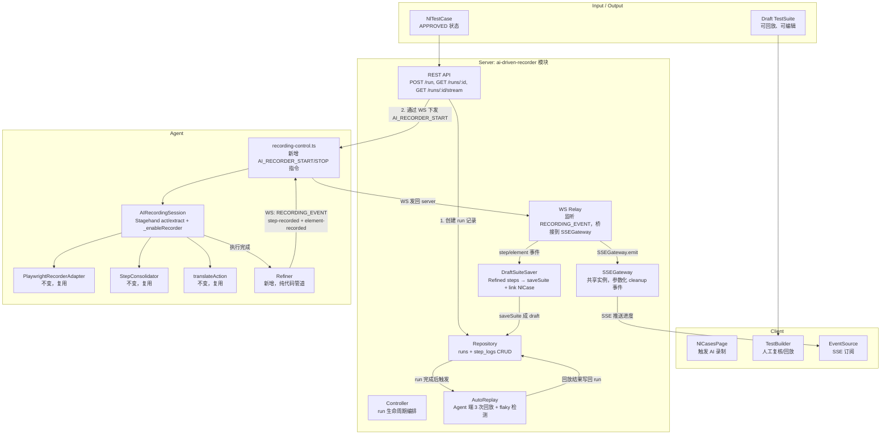
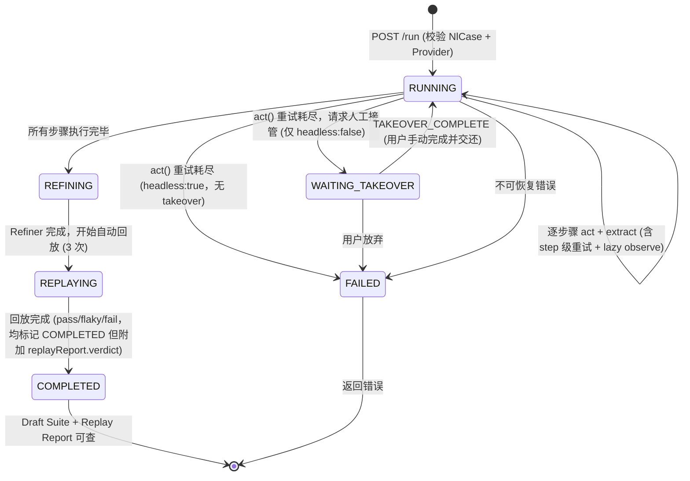
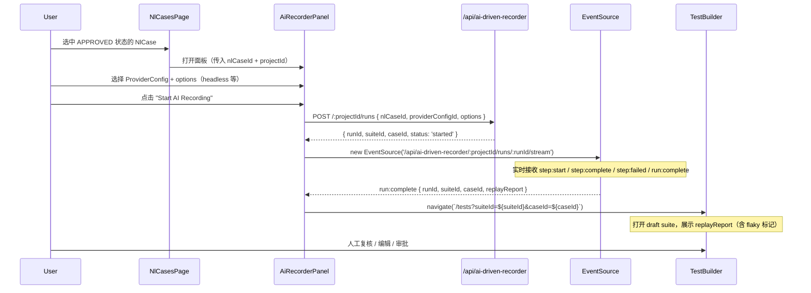

# AI-Driven Recording Engine — 修正版架构方案

> 基于对 `docs/05-AIDrivenRecordingEngine.md` 原方案和当前代码库的交叉分析，修正以下问题：
> - SSE 推送拓扑：Agent 无 HTTP 能力，不能直接操作 SSEGateway
> - 录制事件链路：AI 模式必须同时发射 step + element 事件，否则元素仓库无法建立
> - 录制协议冲突：不应在现有 `RECORDING_START` 上加 `mode=ai`，应走独立模块
> - Provider 兼容性：表述过于绝对，应改为认证矩阵
> - 安全策略：默认 verbose=1 在敏感场景不安全
> - 产物落地：AI 产物应先成 draft suite 再进入人工复核
> - 缺少自动回放验证闭环

---

## 1. Architecture（修正版）

### 1.1 核心流程



**关键修正**：

| # | 原方案问题 | 修正 |
|:---|:---|:---|
| 1 | "Agent 通过 SSEGateway 直接推送 SSE" | Agent 只有 WS 通道。真实链路：`Agent WS → server WS Relay → SSEGateway → Client EventSource` |
| 2 | AI 模式复用 `RECORDING_START` + `mode=ai` | 新增独立 WS 事件类型 `AI_RECORDER_START` / `AI_RECORDER_STOP`，不动现有录制链路 |
| 3 | 只发 `step-recorded` 不发 `element-recorded` | AI 模式必须同时发射两种事件，否则元素仓库和页面发现无法建立 |
| 4 | Provider 表述"只支持 OpenAI/Azure" | 改为认证矩阵：已认证 / 实验性 / 不支持，基于实际联调填写 |
| 5 | 默认 `verbose: 1` | 默认 `verbose: 0`，敏感数据用 Stagehand `variables` 注入 |
| 6 | AI 产物直接写入用户的当前 case | AI 产物先保存为独立 draft suite，通过 `NlTestCase.generatedSuiteId` 关联，再进 TestBuilder 复核 |
| 7 | 无自动回放验证 | Refiner 完成后、run 标记 COMPLETED 前，自动回放 3 次 draft suite，检测 pass/flaky/fail |
| 8 | WS 传解密后 providerConfig | 改为 WS 双向通信：传 providerConfigId，Agent 请求后 server 回传解密 config，避免矛盾 |
| 9 | observe 正则预检 | 改为 lazy observe：act() 首次失败后触发，不再用脆弱的正则判断歧义 |
| 10 | SSEGateway 独占实例 | 重构为参数化 cleanup 事件，按 runId 隔离共享实例，消除代码重复 |
| 11 | WAITING_TAKEOVER 不限 headless | 仅 headless:false 可用；headless 模式重试耗尽直接 FAILED |
| 12 | WS Relay 重复调用 RecordingService | 去除重复调用，step/element 事件由 ws-handlers.ts 统一处理 |

### 1.2 职责边界（修正版）

| 端 | 职责 | 不做的事 |
|:---|:---|:---|
| **Server** | API 入口、DB 持久化、SSE 广播、WS Relay、DraftSuiteSaver、AutoReplay 编排 | 不运行 Refiner、不调 LLM、不碰浏览器 |
| **Agent** | Stagehand 执行、录制捕获、Refiner 精炼、结果回传（通过 WS） | 不直接暴露 REST API、不操作 DB、不直接写 SSE |

---

## 2. Pipeline（修正版）

### 2.1 端到端 Run 生命周期

```
用户 → POST /api/ai-driven-recorder/:projectId/runs
       body: { nlCaseId, providerConfigName, options? }

Server:
  1. 校验 NlTestCase.status === 'APPROVED'
  2. 校验 providerConfig 是否在认证矩阵中
  3. 创建 ai_driven_recording_runs 记录 (status=running)
  4. 解密 providerConfig (内存持有，不落盘)
  5. 发现 idle Agent
  6. 通过 WS 下发 AI_RECORDER_START { runId, nlCase, providerConfig, options }

Agent:
  7. AIRecordingSession.start()
     → Stagehand init + _enableRecorder 挂载
     → 逐 NL step: act() + extract() + _enableRecorder 捕获
     → 每捕获一个 consolidated step:
         emit WS RECORDING_EVENT { event: 'step-recorded', data }
         emit WS RECORDING_EVENT { event: 'element-recorded', data }  ← 新增：和人工录制对齐
     → 每 NL step 完成: emit WS RECORDING_EVENT { event: 'step:complete', data }
     → 全部完成: Refiner.refine()
     → AutoReplay（Agent 端，复用 Stagehand 浏览器，3 次回放 + flaky 检测）
     → emit WS RECORDING_EVENT { event: 'AI_RECORDER_COMPLETE', data: { refinedSteps, extractResults, replayReport } }

Server WS Relay:
   8. [跳过] 'step-recorded' / 'element-recorded' 事件由现有 registerRecordingWsHandlers() 处理（见 ws-handlers.ts:15-23），WS Relay 不应重复调用 RecordingService
   9. 收到 'step:complete' → SSEGateway.emit('step:complete') + 更新 step_log
   10. 收到 'AI_RECORDER_COMPLETE'（已携带 replayReport，由 Agent 端 AutoReplay 产生）→ DraftSuiteSaver.save() → 将 replayReport 写入 run 记录 → 标记 run completed

Client:
  12. EventSource 消费进度事件
  13. run completed → 跳转 TestBuilder 打开 draft suite
```

### 2.2 状态机（修正版）



新增 `REFINING` → `REPLAYING` → `COMPLETED` 三段，确保人工复核前有自动回放结果作为参考。

**WAITING_TAKEOVER 约束**：仅在 `headless: false` 时可用。headless 模式下用户无法操作浏览器，act() 重试耗尽后直接标记 `FAILED`。

---

## 3. Core Components（修正版）

### 3.1 AIRecordingSession

**路径**：`agent/recorder/ai-recording-session.ts`

**与原方案的关键差异**：

| 差异点 | 原方案 | 修正版 | 原因 |
|:---|:---|:---|:---|
| onStepRecorded 回调 | 只发 step 事件 | 同时发 step + element 事件，复用 `emitConsolidatedStep` 逻辑 | 元素仓库和页面发现需要对齐 |
| 录制回调来源 | onStepRecorded 只传 TestStep | 传 RecorderStepPayload，由外部桥接层负责转为 StepInfo + UIElement | 复用现有 `emitConsolidatedStep` 的 step+element 双发射模式 |
| verbose | `verbose: 1` | `verbose: 0` | 安全最佳实践 |
| 敏感数据 | Refiner 后脱敏 | 执行时就用 Stagehand variables，Refiner 二次保险 | 第一道防线应在输入端 |
| observe 预检 | 无 | Lazy observe：act() 首次失败后触发 observe，将观察结果注入重试 instruction | 比正则预检更可靠（不受语言限制、无误报），成本更低（只在对的时机触发） |
| WAITING_TAKEOVER | act() 重试耗尽可触发 | 仅在 `headless: false` 时可用；headless 模式直接标记 FAILED | headless 模式下用户无法操作浏览器，takeover 无意义 |
| providerConfig 传输 | 未明确 | Server 只传 providerConfigId，Agent 通过 WS 双向通信获取解密 config | API key 不在 WS 消息中传输；且避免"Agent 无 HTTP 能力"的架构矛盾 |
| RecordingBridge 契约 | 未提及 | 发射完整的 `StepRecordedEvent['data']` / `ElementRecordedEvent['data']`，由 ws-handlers.ts 统一路由到 RecordingService | 避免数据契约不匹配导致 handleStepRecorded 静默丢弃事件 |

```typescript
interface NlStepBoundary {
  nlStepIndex: number;
  startStepIdx: number;
  endStepIdx: number;
}

interface AIRecordingSessionParams {
  nlCase: NlTestCase;
  providerConfig: ProviderConfig; // server 解密后通过 WS 下发
  options: {
    headless?: boolean;
    maxRetriesPerStep?: number;
    timeoutPerStep?: number;
  };
  onConsolidatedStep: (step: RecorderStepPayload) => void; // 替代 onStepRecorded
  onEvent: (event: string, data: any) => void;
  onTakeoverRequest?: (nlStepIndex: number, instruction: string) => Promise<boolean>; // 仅 headless:false 时有效
}

interface RecordingResult {
  steps: TestStep[];
  extractResults: Map<number, StructuredExtractResult>;
  stepBoundaries: NlStepBoundary[];
  replayCandidateSuite: Partial<TestSuite>; // 供 DraftSuiteSaver 消费
  replayReport?: ReplayReport;              // Agent 端 AutoReplay 结果，随 AI_RECORDER_COMPLETE 上报
}

class AIRecordingSession {
  private stagehand: Stagehand | null = null;
  private consolidator = new StepConsolidator();
  private extractResults: Map<number, StructuredExtractResult> = new Map();
  private recordedSteps: RecorderStepPayload[] = []; // 保留原始 payload
  private stepBoundaries: NlStepBoundary[] = [];
  private isHeadless = false; // 从 options.headless 赋值，控制 takeover 是否可用

  async start(params: AIRecordingSessionParams): Promise<RecordingResult> {
    const { nlCase, providerConfig, options, onConsolidatedStep, onEvent } = params;
    this.isHeadless = options.headless !== false; // 默认 headless

    // 1. 初始化 Stagehand（verbose: 0，安全优先）
    this.stagehand = new Stagehand({
      env: 'LOCAL',
      verbose: 0,
      debugDom: false,
      model: buildStagehandModelName(providerConfig),
      modelClientOptions: buildModelClientOptions(providerConfig),
    });
    await this.stagehand.init();
    const context = this.stagehand.context;
    const page = context.pages()[0];

    // 2. 挂载 _enableRecorder（双路径设计）
    let adapter: PlaywrightRecorderAdapter | null = null;
    if (PlaywrightRecorderAdapter.isAvailable(context)) {
      adapter = new PlaywrightRecorderAdapter({
        onActionAdded: (_page, actionInContext) => {
          const step = translateAction(actionInContext);
          if (!step) return;
          if (!step.pageUrl) step.pageUrl = _page.url();
          for (const consolidated of this.consolidator.add(step)) {
            this.recordedSteps.push(consolidated);
            onConsolidatedStep(consolidated); // 由外部桥接层负责 step+element 双发射
          }
        },
      });
      adapter.start(context);
    } else {
      onEvent('recorder:fallback', { reason: '_enableRecorder not available' });
      // fallback: executeNlStep 内部从 ActResult 构建 RecorderStepPayload
    }

    // 3. 导航到起始页面
    const startUrl = resolveStartUrl(nlCase);
    await page.goto(startUrl);
    await page.waitForLoadState('networkidle');

    // 4. 逐步骤执行
    const sortedSteps = [...nlCase.steps].sort((a, b) => a.sequence - b.sequence);
    for (let i = 0; i < sortedSteps.length; i++) {
      const boundary = await this.executeNlStep(i, sortedSteps[i], page, onEvent, params.onTakeoverRequest);
      this.stepBoundaries.push(boundary);
    }

    // 5. Flush consolidator
    for (const flushed of this.consolidator.flush()) {
      this.recordedSteps.push(flushed);
      onConsolidatedStep(flushed);
    }

    // 6. Refine
    const refiner = new Refiner();
    const refinedSteps = refiner.refine(
      this.recordedSteps,
      this.stepBoundaries,
      this.extractResults,
    );

    // 6.5 AutoReplay（策略 B：Agent 端执行，复用 Stagehand 浏览器上下文）
    // 必须在 Stagehand 关闭前执行，否则需要重新启动浏览器，延迟和成本都会上升。
    // 回放结果随 RecordingResult.replayReport 返回，由 AI_RECORDER_COMPLETE 上报给 Server，
    // Server 直接写入 DB 的 replay_report 字段，不再调用 AutoReplay。
    const suiteSkeleton = buildSuiteSkeleton(nlCase, refinedSteps);
    const replayReport = await autoReplayDraftSuite(suiteSkeleton, {
      page,                // 复用当前 Stagehand 的 page
      startUrl,            // 每次回放前重置到起始 URL
    });

    // 7. 清理
    if (adapter) adapter.stop();
    await this.stagehand.close();
    this.stagehand = null;

    return {
      steps: refinedSteps,
      extractResults: this.extractResults,
      stepBoundaries: this.stepBoundaries,
      replayCandidateSuite: suiteSkeleton,
      replayReport,
    };
  }

  private async executeNlStep(
    nlStepIndex: number,
    nlStep: NlTestCaseStep,
    page: Page,
    emit: (event: string, data: any) => void,
    onTakeoverRequest?: (nlStepIndex: number, instruction: string) => Promise<boolean>,
  ): Promise<NlStepBoundary> {
    const maxRetries = 2;
    const startStepIdx = this.recordedSteps.length;

    emit('step:start', { stepIndex: nlStepIndex, instruction: nlStep.action });

    // --- 阶段 0: observe（lazy observe — 仅在 act() 首次失败后触发）---
    // 不使用正则预检：正则仅支持中文、误将"然后"等顺序连接词标记为歧义。
    // Stagehand 最佳实践：observe 成本远低于 act 失败后的重试成本，
    // 但也不是所有 step 都需要 observe。折中方案是 lazy observe：
    // act() 首次失败 → observe 收集页面可操作元素 → 用观察结果辅助第二次 act。
    // 具体实现：act 失败后先 observe，将观察结果拼入重试的 instruction。

    // --- 阶段 1: 执行 act()（带脏状态自愈重试 + lazy observe）---
    let actSuccess = false;
    let observeHint: string | null = null;
    for (let attempt = 0; attempt <= maxRetries; attempt++) {
      try {
        const actInstruction = observeHint
          ? `${nlStep.action} (Context: ${observeHint})`
          : nlStep.action;
        await this.stagehand!.act(actInstruction, { page });
        actSuccess = true;
        break;
      } catch (err: any) {
        // Lazy observe：仅在首次失败（attempt === 0）后触发一次 observe。
        // 不在后续重试中重复 observe，避免无限 observe 循环；
        // 也不在 act 前预检，避免对无需 observe 的 step 浪费 LLM 调用。
        // attempt === 0 已隐含 attempt < maxRetries（maxRetries=2），无需冗余判断。
        if (attempt === 0) {
          try {
            const observations = await this.stagehand!.observe(page);
            if (observations.length > 0) {
              observeHint = observations
                .filter((o: any) => o.selector || o.description)
                .map((o: any) => o.description || o.selector)
                .slice(0, 3)
                .join('; ');
              emit('step:observe', { stepIndex: nlStepIndex, observationCount: observations.length });
            }
          } catch { /* observe 失败不阻断重试 */ }
        }

        if (attempt >= maxRetries) {
          // Takeover 仅在 headless:false 时可用；
          // headless 模式下用户无法操作浏览器，takeover 无意义
          if (onTakeoverRequest && !this.isHeadless) {
            emit('step:takeover', { stepIndex: nlStepIndex, instruction: nlStep.action, error: err.message });
            const takenOver = await onTakeoverRequest(nlStepIndex, nlStep.action);
            if (takenOver) {
              emit('step:complete', { stepIndex: nlStepIndex });
              return { nlStepIndex, startStepIdx, endStepIdx: this.recordedSteps.length };
            }
          }
          emit('step:failed', { stepIndex: nlStepIndex, reason: `act() failed: ${err.message}` });
          return { nlStepIndex, startStepIdx, endStepIdx: this.recordedSteps.length };
        }
        // 脏状态自愈：extract 评估页面状态 → cleanup act → 重试
        try {
          const recoveryHint = await this.stagehand!.extract({
            instruction: `The previous action "${nlStep.action}" failed. Assess page state for blocking overlays, partial dropdowns. Describe what needs dismissal.`,
            schema: z.object({ needsCleanup: z.boolean(), cleanupInstruction: z.string().optional() }),
          });
          if (recoveryHint.needsCleanup && recoveryHint.cleanupInstruction) {
            await this.stagehand!.act(recoveryHint.cleanupInstruction, { page });
          }
        } catch { /* 恢复失败不阻断重试 */ }
      }
    }

    // --- 阶段 2: 验证 extract()（仅当 expected 存在，仅重试 extract）---
    if (actSuccess && nlStep.expected) {
      let verified = false;
      for (let attempt = 0; attempt <= maxRetries; attempt++) {
        try {
          const result = await this.stagehand!.extract({
            instruction: `Verify: "${nlStep.expected}". Return structured assertions.`,
            schema: EXTRACT_ASSERTION_SCHEMA,
          });
          if (result.success) {
            this.extractResults.set(nlStepIndex, result);
            verified = true;
            break;
          }
        } catch { /* extract 是观察性操作，重试安全 */ }
      }
      if (!verified) {
        emit('step:failed', { stepIndex: nlStepIndex, reason: 'expected not met after retries' });
      }
    }

    // --- 阶段 3: fallback 路径（_enableRecorder 不可用时）---
    // 如果 adapter 为 null，从 act() 的 ActResult 中构建 RecorderStepPayload
    // 这部分在 adapter === null 时由 executeNlStep 内部处理

    emit('step:complete', { stepIndex: nlStepIndex });
    return { nlStepIndex, startStepIdx, endStepIdx: this.recordedSteps.length };
  }
}
```

### 3.2 RecordingBridge — 新增组件

**路径**：`agent/recorder/recording-bridge.ts`

**职责**：把 AIRecordingSession 输出的 `RecorderStepPayload` 转为和人工录制完全一致的 WS 事件（step-recorded + element-recorded），确保 `RecordingService` 能正常处理。

这是原方案缺失的关键组件。人工录制时，`RecordingManager.emitConsolidatedStep()` 同时发射 step 和 element 两种事件（`agent/recorder/index.ts:245-304`）。AI 模式必须复用这一逻辑，否则元素仓库不会更新。

```typescript
import { locatorRefToLegacyDef, locatorRefToName } from './locator.ts';
import type { RecorderStepPayload, LocatorRef } from './protocol.ts';
import type { UIElement, TestStep } from '../../shared/contracts/index.ts';
import type { StepInfo, StepRecordedEvent, ElementRecordedEvent } from '../../shared/recording/protocol.ts';

// Bridge 回调必须发射完整的 StepRecordedEvent['data'] / ElementRecordedEvent['data']，
// 因为这些数据会直接进入 WS RECORDING_EVENT 信封，由 ws-handlers.ts 的
// registerRecordingWsHandlers() 路由到 RecordingService 处理。
// RecordingService.handleStepRecorded 需要 { projectId, stepInfo, type, caseId, suiteId }，
// RecordingService.handleElementRecorded 需要 { projectId, pageId?, element }。
// 如果缺少 projectId，handleStepRecorded 会因 `if (!project || !stepInfo) return;` 静默丢弃。
interface BridgeCallbacks {
  emitStepRecorded: (data: StepRecordedEvent['data']) => void;
  emitElementRecorded: (data: ElementRecordedEvent['data']) => void;
}

export function bridgeConsolidatedStep(
  cleanStep: RecorderStepPayload,
  projectId: string,
  caseId: string,
  suiteId: string,
  callbacks: BridgeCallbacks,
): void {
  const locator = cleanStep.locator;
  const legacy = locator ? locatorRefToLegacyDef(locator) : undefined;
  const elementName = locator ? locatorRefToName(locator) : '';
  const dataValue = cleanStep.value || '';

  const stepRecord: TestStep = {
    id: `step-${Math.random().toString(36).slice(2, 10)}`,
    action: cleanStep.action,
    target: cleanStep.action === 'goto' ? (cleanStep.value || '') : elementName,
    data: dataValue,
    description: buildStepDescription(cleanStep.action, locator, dataValue),
    isVerified: true,
    metadata: {
      recorder: {
        locator,
        locatorCandidates: cleanStep.locatorCandidates,
        legacyLocator: legacy,
        framePath: cleanStep.metadata?.framePath || [],
        pageUrl: cleanStep.pageUrl,
        timestamp: cleanStep.timestamp,
      },
    },
  };

  const uiElement: UIElement | undefined = locator && legacy ? {
    ...legacy,
    id: `el-${Math.random().toString(36).slice(2, 10)}`,
    name: elementName,
    pageUrl: cleanStep.pageUrl,
    metadata: stepRecord.metadata,
  } : undefined;

  // 和人工录制一致：每次 consolidated step 同时发射 step + element
  // 发射完整的 StepRecordedEvent['data']，包含 projectId/type/caseId/suiteId
  callbacks.emitStepRecorded({
    projectId,
    stepInfo: {
      action: cleanStep.action,
      element: uiElement,
      dataValue,
      step: stepRecord,
    },
    type: 'UI',
    caseId,
    suiteId,
  });

  if (locator && legacy) {
    // 发射完整的 ElementRecordedEvent['data']，包含 projectId
    callbacks.emitElementRecorded({
      projectId,
      element: {
        id: `el-${Math.random().toString(36).slice(2, 10)}`,
        name: elementName,
        selectorType: legacy.selectorType,
        value: legacy.value,
        description: elementName,
        pageUrl: cleanStep.pageUrl,
        locators: [legacy],
        metadata: {
          recorder: {
            locator,
            framePath: cleanStep.metadata?.framePath || [],
          },
        },
      },
      caseId,
      suiteId,
    });
  }
}

function buildStepDescription(action: string, locator?: LocatorRef, value?: string): string {
  if (action === 'goto') return `Navigate to ${value || 'URL'}`;
  const name = locatorRefToName(locator) || 'unknown element';
  switch (action) {
    case 'click': return `Click on ${name}`;
    case 'dblclick': return `Double click on ${name}`;
    case 'fill': return `Type "${value}" into ${name}`;
    case 'press': return `Press ${value} key on ${name}`;
    case 'selectOption': return `Select "${value}" in ${name}`;
    case 'check': return `Check ${name}`;
    case 'uncheck': return `Uncheck ${name}`;
    case 'hover': return `Hover over ${name}`;
    case 'dragTo': return `Drag ${name} to destination`;
    case 'setInputFiles': return `Upload file(s) to ${name}: ${value}`;
    default: return value ? `${action} on ${name}: ${value}` : `${action} on ${name}`;
  }
}
```

**重要**：`RecordingBridge.bridgeConsolidatedStep()` 的逻辑就是从 `RecordingManager.emitConsolidatedStep()` (`agent/recorder/index.ts:245-304`) 提取出来的。最终应该把 `RecordingManager.emitConsolidatedStep` 重构为调用 `bridgeConsolidatedStep`，消除重复。

### 3.3 Refiner（新增 Provenance 标记）

**路径**：`agent/recorder/refiner.ts`

与原方案基本一致，新增一个 ProvenanceTagger 阶段：

```
Raw Steps → [Deduplicator] → [AssertionMapper] → [Parameterizer] → [PasswordSanitizer] → [SelectorExpander] → [ProvenanceTagger] → Refined Steps
```

| 阶段 | 输入 | 输出 | 说明 |
|:---|:---|:---|:---|
| Deduplicator | rawSteps | 去重后的 steps | 相邻相同步骤合并 |
| AssertionMapper | steps + boundaries + extractResults | 带断言的 steps | 按 boundary 将 extract 结果映射到对应步骤组的最后一步 |
| Parameterizer | steps | 参数化的 steps | 正则识别硬编码数据，避免 `id` 泛匹配 |
| PasswordSanitizer | steps | 密码脱敏的 steps | 检测 password 类填写，提取值为变量 |
| SelectorExpander | steps | 展开选择器的 steps | 补充多策略选择器（CSS + role + label） |
| **ProvenanceTagger** | steps + boundaries | 带 provenance 的 steps | 在每个 step 的 metadata 中添加 `nlStepIndex`、原始 `instruction`、`actRetryCount`、`extractResult` 摘要、是否走了 fallback |

```typescript
interface StepProvenance {
  nlStepIndex: number;
  instruction: string;
  actRetryCount: number;
  extractSuccess: boolean;
  fromFallback: boolean; // 是否来自 ActResult fallback
}

private tagProvenance(steps: TestStep[], boundaries: NlStepBoundary[], extractResults: Map<number, StructuredExtractResult>): TestStep[] {
  return steps.map((step, idx) => {
    const boundary = boundaries.find(b => idx >= b.startStepIdx && idx < b.endStepIdx);
    if (!boundary) return step;

    const provenance: StepProvenance = {
      nlStepIndex: boundary.nlStepIndex,
      instruction: '', // 从外部传入
      actRetryCount: 0,
      extractSuccess: extractResults.has(boundary.nlStepIndex),
      fromFallback: false,
    };

    return {
      ...step,
      metadata: {
        ...step.metadata,
        provenance,
      },
    };
  });
}
```

### 3.4 DraftSuiteSaver — 新增组件

**路径**：`server/modules/ai-driven-recorder/draft-suite-saver.ts`

AI 产物不应直接写入用户当前 case，而是创建一个独立的 draft suite，通过 `NlTestCase.generatedSuiteId` 关联。

```typescript
import { randomId } from '../../shared/utils/index.ts';
import type { TestSuite, TestStep, NlTestCase } from '../../../shared/contracts/index.ts';
import { saveSuite } from '../suites/repository.ts';
import { nlCaseRepo } from '../nl-cases/repository.ts';

interface SaveDraftResult {
  suiteId: string;
  caseId: string;
  suite: TestSuite;
}

export function saveDraftSuite(
  projectId: string,
  nlCase: NlTestCase,
  refinedSteps: TestStep[],
): SaveDraftResult {
  const suiteId = randomId('suite');
  const caseId = randomId('case');

  const suite: Partial<TestSuite> = {
    id: suiteId,
    projectId,
    name: `[AI Draft] ${nlCase.title}`,
    description: `Auto-generated from NL case: ${nlCase.id}`,
    cases: [{
      id: caseId,
      name: nlCase.title,
      description: nlCase.title,
      steps: refinedSteps,
      setupSteps: [],
      teardownSteps: [],
    }],
    variables: [],
    dataRows: [],
    setupSteps: [],
    teardownSteps: [],
  };

  const saved = saveSuite(suite);

  // 关联：将 generatedSuiteId 写回 NlTestCase
  nlCaseRepo.patch(nlCase.id, { generatedSuiteId: suiteId });

  return { suiteId, caseId, suite: saved };
}
```

### 3.5 AutoReplay — 新增组件

**路径**：`server/modules/ai-driven-recorder/auto-replay.ts`

Refiner 完成后、run 标记 COMPLETED 前，自动回放 draft suite **3 次**。3 次回放用于检测 flaky test（业界最佳实践：Mabl、Reflect 均采用多次回放机制）。

```typescript
import type { TestSuite } from '../../../shared/contracts/index.ts';

export type ReplayVerdict = 'pass' | 'fail' | 'flaky';

export interface SingleReplayResult {
  totalSteps: number;
  passedSteps: number;
  failedSteps: number;
  stepResults: Array<{
    stepIndex: number;
    action: string;
    target: string;
    passed: boolean;
    error?: string;
  }>;
  durationMs: number;
}

export interface ReplayReport {
  runs: number;                         // 回放次数（默认 3）
  passCount: number;                    // 通过次数
  failCount: number;                    // 失败次数
  verdict: ReplayVerdict;               // pass(3/3) | flaky(2/3 或 1/3) | fail(0/3)
  results: SingleReplayResult[];       // 每次回放的详细结果
  overallPass: boolean;                 // verdict === 'pass'
  totalDurationMs: number;
  // 降级支持：Agent 侧如果无法跑 3 次（如浏览器资源不足），至少 1 次也行
  degraded?: boolean;                   // true 表示实际跑的次数 < 3
}

const DEFAULT_REPLAY_RUNS = 3;

/**
 * AutoReplay — 策略 B：Agent 端执行
 *
 * 执行位置：AIRecordingSession.start() 第 6.5 步，Refiner 之后、Stagehand.close() 之前。
 * 复用 Stagehand 已打开的浏览器上下文，避免重新启动浏览器的延迟和资源开销。
 *
 * 执行流程：
 * 1. Agent 在 AIRecordingSession 内调用本函数，传入 page 和 startUrl
 * 2. 函数对 refinedSteps 做 UIExecutor 风格回放，重复 N 次（默认 3）
 * 3. 每次回放前重置页面到 startUrl
 * 4. 返回 ReplayReport，随 RecordingResult.replayReport 返回
 * 5. AI_RECORDER_COMPLETE 事件携带 replayReport 上报给 Server
 * 6. Server Controller 收到后直接写入 DB 的 replay_report 字段，不再调用 AutoReplay
 *
 * @param suite refinedSteps 构建的 suite skeleton
 * @param options.page Stagehand 当前 page（复用浏览器上下文）
 * @param options.startUrl 每次回放前重置到的起始 URL
 * @param options.replayRuns 回放次数，默认 3
 */
export async function autoReplayDraftSuite(
  suite: TestSuite,
  options: {
    page: Page;
    startUrl: string;
    replayRuns?: number;
  },
): Promise<ReplayReport> {
  const targetRuns = options.replayRuns ?? DEFAULT_REPLAY_RUNS;
  const results: SingleReplayResult[] = [];
  const startTime = Date.now();

  for (let run = 0; run < targetRuns; run++) {
    const result = await replayOnce(suite, options.page, options.startUrl);
    results.push(result);
    // 提前终止：最后两次都 fail，无需跑完 3 次确认是 fail
    // 注意：不能用 results.every()，否则 [pass, fail, fail] 不会终止（错误）
    if (run >= 1 && results[run].failedSteps > 0 && results[run - 1].failedSteps > 0) break;
  }

  const passCount = results.filter(r => r.failedSteps === 0).length;
  const failCount = results.length - passCount;

  let verdict: ReplayVerdict;
  if (passCount === results.length) verdict = 'pass';
  else if (failCount === results.length) verdict = 'fail';
  else verdict = 'flaky';

  return {
    runs: results.length,
    passCount,
    failCount,
    verdict,
    results,
    overallPass: verdict === 'pass',
    totalDurationMs: Date.now() - startTime,
    degraded: results.length < targetRuns,
  };
}

async function replayOnce(
  suite: TestSuite,
  page: Page,
  startUrl: string,
): Promise<SingleReplayResult> {
  // 每次回放前重置到起始 URL
  await page.goto(startUrl);
  await page.waitForLoadState('networkidle');
  // ... 实际执行逻辑：复用 UIExecutor.executeStep() 路径执行 suite.steps ...
  // 返回 SingleReplayResult
}
```

**策略 B 的执行位置**：AutoReplay 在 Agent 端 `AIRecordingSession.start()` 的第 6.5 步执行（Refiner 之后、Stagehand.close() 之前），复用 Stagehand 已打开的浏览器上下文。回放结果随 `RecordingResult.replayReport` 返回，由 `AI_RECORDER_COMPLETE` 事件上报给 Server。Server Controller 收到后直接写入 DB 的 `replay_report` 字段，**不再调用 AutoReplay**。

**为什么不在 Server 端执行**：
1. Server 不碰浏览器（职责边界），AutoReplay 需要浏览器
2. 复用 Agent 已打开的 Stagehand 浏览器，避免重新启动的开销（启动 + 关闭浏览器约 2-5 秒）
3. 回放结果随 `AI_RECORDER_COMPLETE` 一次性上报，减少 WS 往返

**Flaky 检测意义**：如果 3 次回放中 1 次失败，verdict 标记为 `flaky` 而非 `fail`。TestBuilder 前端可以对 `flaky` step 做特殊高亮，帮助用户判断是 AI 生成逻辑问题还是页面本身的不稳定。

---

## 4. WS Integration（修正版）

原方案在 `recording-control.ts` 的 `RECORDING_START` 中加 `mode=ai` 分支。这会污染现有录制协议。修正版使用独立的 WS 事件类型。

### 4.1 新增 WS 事件

在 `shared/recording/protocol.ts` 中新增：

```typescript
// AI 驱动录制的 WS 指令事件
export type AiRecorderWsEvent =
  | { event: 'AI_RECORDER_START'; data: {
      runId: string;
      projectId: string;
      nlCase: NlTestCase;
      providerConfigId: string;  // 只传 ID，不传解密后的 config
      options: { headless?: boolean; maxRetriesPerStep?: number; timeoutPerStep?: number };
      caseId: string;  // draft case id (由 server 预分配)
      suiteId: string;  // draft suite id (由 server 预分配)
    }}
  | { event: 'AI_RECORDER_STOP'; data: { runId: string } }
  | { event: 'AI_RECORDER_TAKEOVER_COMPLETE'; data: { runId: string; nlStepIndex: number } }
  // Agent → Server：请求解密后的 providerConfig（避免 WS 消息中携带 API key，
  // 且避免"Agent 无 HTTP 能力"与"Agent 回调 HTTP 接口"的矛盾）
  | { event: 'AI_RECORDER_PROVIDER_CONFIG_REQUEST'; data: {
      runId: string;
      providerConfigId: string;
    }}
  // Server → Agent：回传解密后的 providerConfig
  | { event: 'AI_RECORDER_PROVIDER_CONFIG_RESPONSE'; data: {
      runId: string;             // 关联到具体 run，便于 Agent 路由响应
      providerConfigId: string;
      providerConfig: ProviderConfig;  // server 解密后通过 WS 回传
    }};
```

**Provider 配置传输策略**：WS 消息中只传 `providerConfigId`，Agent 收到 `AI_RECORDER_START` 后，通过 WS 发送 `AI_RECORDER_PROVIDER_CONFIG_REQUEST` 请求，Server 通过 `AI_RECORDER_PROVIDER_CONFIG_RESPONSE` 回传解密后的配置。全程走 WS 双向通信，避免"Agent 无 HTTP 能力"与"Agent 回调 HTTP 接口"的矛盾。API key 不落盘、不缓存在 Agent 端，每次 run 请求时实时获取，run 结束后立即释放。

**`fetchProviderConfigViaWs` 实现要点**：
```typescript
async function fetchProviderConfigViaWs(
  deps: AgentDeps,
  runId: string,
  providerConfigId: string,
): Promise<ProviderConfig> {
  return new Promise((resolve, reject) => {
    const timeout = setTimeout(() => {
      cleanup();
      reject(new Error('Provider config request timeout'));
    }, 10_000);

    const onResponse = (data: any) => {
      if (data?.runId !== runId) return;  // 按 runId 路由响应
      if (data?.providerConfigId !== providerConfigId) return;
      cleanup();
      resolve(data.providerConfig);
    };

    const cleanup = () => {
      clearTimeout(timeout);
      deps.offWsEvent('AI_RECORDER_PROVIDER_CONFIG_RESPONSE', onResponse);
    };

    deps.onWsEvent('AI_RECORDER_PROVIDER_CONFIG_RESPONSE', onResponse);
    deps.emitWs('AI_RECORDER_PROVIDER_CONFIG_REQUEST', { runId, providerConfigId });
  });
}
```

### 4.2 Agent 侧处理

在 `agent/recording-control.ts` 中新增处理逻辑，和现有 `RECORDING_START` 平级：

```typescript
if (parsed.event === 'AI_RECORDER_START') {
  const { runId, projectId, nlCase, providerConfigId, options, caseId, suiteId } = parsed.data || {};
  deps.logger.info(`[AGENT] Received AI Recorder Start: run=${runId} nlCase=${nlCase.id}`);

  // Agent 通过 WS 双向通信获取解密后的 providerConfig
  // 不使用 HTTP 回调（Agent 无独立 HTTP capability in headless mode）
  const providerConfig = await fetchProviderConfigViaWs(deps, runId, providerConfigId);

  const session = new AIRecordingSession();
  const bridge = new RecordingBridge(projectId, caseId, suiteId, {
    // Bridge 已发射完整的 StepRecordedEvent['data']，直接传入 emitRecordingEvent
    emitStepRecorded: (stepEventData) => {
      deps.emitRecordingEvent(STEP_RECORDED_EVENT, stepEventData);
    },
    // Bridge 已发射完整的 ElementRecordedEvent['data']，直接传入 emitRecordingEvent
    emitElementRecorded: (elementEventData) => {
      deps.emitRecordingEvent(ELEMENT_RECORDED_EVENT, elementEventData);
    },
  });

  const result = await session.start({
    nlCase,
    providerConfig,
    options,
    onConsolidatedStep: (step) => bridge.bridgeConsolidatedStep(step),
    onEvent: (event, data) => {
      deps.emitRecordingEvent(event, { ...data, runId, caseId, suiteId });
    },
    onTakeoverRequest: async (nlStepIndex, instruction) => {
      // 注意：'step:takeover' 事件已由 executeNlStep 内部 emit（见 ai-recording-session.ts），
      // 此处不再重复 emit，仅负责等待 AI_RECORDER_TAKEOVER_COMPLETE 或超时。
      // Server 收到 'step:takeover' 后通过 SSE 推送给前端，前端引导用户手动完成操作。
      return new Promise<boolean>((resolve) => {
        const timeout = setTimeout(() => resolve(false), 120_000);
        takeoverCallbacks.set(runId, { resolve, clearTimeout: () => clearTimeout(timeout) });
      });
    },
  });

  deps.emitRecordingEvent('AI_RECORDER_COMPLETE', { runId, result, caseId, suiteId });
  return true;
}

if (parsed.event === 'AI_RECORDER_STOP') {
  // 中止当前 session
  const { runId } = parsed.data || {};
  // ...
  return true;
}

if (parsed.event === 'AI_RECORDER_TAKEOVER_COMPLETE') {
  const { runId, nlStepIndex } = parsed.data || {};
  const cb = takeoverCallbacks.get(runId);
  if (cb) {
    cb.clearTimeout();
    cb.resolve(true);
    takeoverCallbacks.delete(runId);
  }
  return true;
}
```

### 4.3 Server 侧 WS Relay

在 `server/modules/ai-driven-recorder/ws-relay.ts` 中：

```typescript
import { globalEventBus } from '../../shared/services/eventBus.ts';
import { sseGateway } from './index.ts'; // 共享 SSEGateway 实例（见修正说明）

// 注意：不再实例化 RecordingService！
// step-recorded / element-recorded 事件由 ws-handlers.ts 的
// registerRecordingWsHandlers() 统一处理，AI 模式复用该链路。
// 在此处再次调用 RecordingService 会导致每个 step 被重复处理
// （重复插入 step + 重复添加 element 到仓库）。

export function registerAiRecorderWsRelay() {
  globalEventBus.on('RECORDING_EVENT', (data: unknown) => {
    const envelope = data as RecordingEnvelope;
    const { event, data: innerData } = envelope || {};
    if (!event) return;

    // AI 录制进度事件 → 桥接到 SSEGateway
    if (event === 'step:start' || event === 'step:complete' ||
        event === 'step:failed' || event === 'step:takeover' ||
        event === 'step:observe' || event === 'recorder:fallback') {
      const runId = innerData?.runId;
      if (runId) {
        sseGateway.emit(runId, event, innerData);
      }
    }

    // AI 录制完成 → SSE 广播（DraftSuiteSaver + replayReport 写入 DB 在 Controller 中）
    // AutoReplay 已在 Agent 端执行，replayReport 随本事件上报，Server 不再调用 AutoReplay
    if (event === 'AI_RECORDER_COMPLETE') {
      const runId = innerData?.runId;
      if (runId) {
        sseGateway.emit(runId, 'run:complete', innerData);
      }
    }

    // step-recorded / element-recorded 已由 registerRecordingWsHandlers() 处理，
    // 此处不再重复调用 RecordingService
  });
}
```

**SSEGateway 实例策略修正**：

原方案说"独占 SSEGateway 实例"。但查看 `sse-gateway.ts`，SSEGateway 是按 `runId` 隔离的通用 EventEmitter 容器，两个模块共享实例不会有事件格式冲突——只要 `runId` 不碰撞（随机 ID 不会碰撞）。

真正的问题在于：现有 `SSEGateway` 在 `attachStream` 的 `onSse` 回调（第 71-73 行）和 buffer 回放（第 88-90 行）中硬编码了 `pipeline:complete` / `pipeline:error` 作为 stream cleanup 触发事件。AI recorder 的 `run:complete` 不会触发 cleanup，导致 SSE 连接不会在 run 完成后自动关闭。

**正确方案**：重构 `SSEGateway`，将 cleanup 事件名做成构造参数：

```typescript
export class SSEGateway {
  constructor(private readonly cleanupEvents: string[] = ['pipeline:complete', 'pipeline:error']) {}

  // attachStream 中：
  const onSse = (event: string, data: unknown) => {
    res.write(`event: ${event}\ndata: ${JSON.stringify(data)}\n\n`);
    if (this.cleanupEvents.includes(event)) {
      cleanup();
    }
  };
}
```

AI recorder 模块创建实例时传入 `new SSEGateway(['run:complete', 'run:error'])`，ai-test-gen 保持默认配置。两个实例共享相同的底层逻辑但配置不同的 cleanup 事件。

**这是一个小的重构**，比独占实例更可取，因为：
1. 消除代码重复（两个实例的 attachStream/emit/buffer 逻辑完全相同）
2. cleanup 事件名是唯一的差异点，用构造参数表达更清晰
3. 未来新增使用 SSEGateway 的模块也不需要再复制一份

---

## 5. extract() Schema Design（修正版）

与原方案一致，但扩展 `source` 枚举，覆盖 `assertions.ts` 支持的完整 UI 断言源：

```typescript
const EXTRACT_ASSERTION_SCHEMA = {
  success: z.boolean(),
  assertions: z.array(z.object({
    source: z.enum([
      'UI_PAGE_URL',
      'UI_PAGE_TITLE',
      'UI_TEXT',
      'UI_VALUE',
      'UI_ELEMENT_VISIBLE',   // assertions.ts:96  已支持
      'UI_ELEMENT_ENABLED',   // assertions.ts:98  已支持
      'UI_ELEMENT_CHECKED',   // assertions.ts:100 已支持
      'UI_ELEMENT_COUNT',     // assertions.ts:94  已支持
      'UI_ATTRIBUTE',         // assertions.ts:87  已支持
    ]),
    operator: z.enum([
      'EQUALS', 'NOT_EQUALS', 'CONTAINS', 'NOT_CONTAINS',
      'MATCHES_REGEX', 'EXISTS', 'NOT_EXISTS',
    ]),
    expectedValue: z.string(),
    expression: z.string().optional(), // UI_ATTRIBUTE 需要属性名
  })),
};
```

原方案只有 `UI_PAGE_URL, UI_TEXT, UI_ELEMENT_VISIBLE, UI_ELEMENT_ENABLED`，缺少 `UI_ELEMENT_CHECKED, UI_ELEMENT_COUNT, UI_ATTRIBUTE, UI_PAGE_TITLE` 和更多 operator。修正版覆盖 `assertions.ts` 的完整能力。

---

## 6. Provider Compatibility（修正版：认证矩阵）

原方案说"Stagehand v3 依赖 Responses API，只支持 OpenAI/Azure"。这过于绝对。Stagehand 官方文档 (`https://docs.stagehand.dev/v3/configuration/models`) 支持 OpenAI、Anthropic、Google 及自定义 `modelClientOptions`。

修正版使用认证矩阵：

| Provider 类型 | 产品当前建模 | Stagehand 原生支持 | AI 驱动录制认证等级 | 说明 |
|:---|:---|:---|:---|:---|
| OpenAI 官方 | `openai-compatible` + `api.openai.com` | ✅ | **已认证** | 产品需新增 `openai` provider 类型 |
| Azure OpenAI | `azure-openai` | ✅ | **已认证** | Responses API 支持，最稳定 |
| Anthropic | 无 | ✅ | **实验性** | 产品需新增 `anthropic` provider 类型 |
| Google Gemini | 无 | ✅ | **实验性** | 产品需新增 `google` provider 类型 |
| 其他 OpenAI-compatible | `openai-compatible` | 需 `modelClientOptions` | **待验证** | 需逐一实测 structured output + act() 可靠性 |

**UI 限制修正**：
- 仅 `已认证` 的 provider 显示 AI 驱动录制入口
- `实验性` 显示入口但标注 "Beta"
- `待验证` 不显示入口，引导用户提交 provider 测试请求

**安全**：Provider 配置不直接通过 WS 消息传输。改为 WS 中只传 `providerConfigId`，Agent 收到 `AI_RECORDER_START` 后通过 WS 发送 `AI_RECORDER_PROVIDER_CONFIG_REQUEST`，Server 通过 `AI_RECORDER_PROVIDER_CONFIG_RESPONSE` 回传解密后的配置。全程走 WS 双向通信，避免"Agent 无 HTTP 能力"与"Agent 回调 HTTP 接口"的架构矛盾。API key 不落盘、不缓存在 Agent 端，每次 run 请求时实时获取，run 结束后立即释放。

---

## 7. Database Schema（修正版）

```sql
-- 运行记录
CREATE TABLE ai_driven_recording_runs (
  id TEXT PRIMARY KEY,
  project_id TEXT NOT NULL,
  nl_case_id TEXT NOT NULL,
  provider_config_id TEXT,               -- 新增：关联到哪个 provider config
  status TEXT NOT NULL DEFAULT 'running', -- running | refining | replaying | completed | failed
  started_at TEXT NOT NULL DEFAULT (datetime('now')),
  completed_at TEXT,
  total_steps INTEGER NOT NULL DEFAULT 0,
  completed_steps INTEGER NOT NULL DEFAULT 0,
  failed_steps INTEGER NOT NULL DEFAULT 0,
  result_suite_id TEXT,                   -- 修正：改为 suite_id 而非 case_id
  result_case_id TEXT,                    -- draft case id
  replay_report TEXT,                     -- 新增：JSON，回放报告
  error TEXT,
  options TEXT,                           -- 新增：JSON，run 启动时的 options 参数
  token_usage TEXT,                       -- 新增：JSON，累计 token 用量
  FOREIGN KEY (nl_case_id) REFERENCES natural_language_test_cases(id)
);

-- 步骤日志
CREATE TABLE ai_driven_recording_step_logs (
  id TEXT PRIMARY KEY,
  run_id TEXT NOT NULL REFERENCES ai_driven_recording_runs(id) ON DELETE CASCADE,
  nl_step_index INTEGER NOT NULL,
  instruction TEXT NOT NULL,
  expected TEXT,
  success INTEGER NOT NULL DEFAULT 0,    -- 修正：0/1 而非 NOT NULL
  assertions TEXT,                        -- JSON
  recorded_step_count INTEGER NOT NULL DEFAULT 0,
  retry_count INTEGER NOT NULL DEFAULT 0,
  duration_ms INTEGER,
  error TEXT,
  provenance TEXT,                        -- 新增：JSON，步骤溯源信息
  created_at TEXT NOT NULL DEFAULT (datetime('now'))
);

CREATE INDEX idx_ai_rec_step_run ON ai_driven_recording_step_logs(run_id);
CREATE INDEX idx_ai_rec_status ON ai_driven_recording_runs(status);
CREATE INDEX idx_ai_rec_project ON ai_driven_recording_runs(project_id);
```

与原方案差异：
- 新增 `provider_config_id` 关联
- 新增 `result_suite_id` 替代 `result_case_id`（走 draft suite 模式）
- 新增 `replay_report` 存储回放报告
- 新增 `options` 存储启动参数
- 新增 `token_usage` 追踪 LLM 消费
- 状态增加 `refining` / `replaying`
- step_logs 新增 `provenance` 字段

---

## 8. REST API（修正版）

### 8.1 模块注册

独立模块，basePath `/api/ai-driven-recorder`，不和其他模块冲突：

```typescript
// server/modules/ai-driven-recorder/index.ts
export const aiDrivenRecorderModule = {
  basePath: '/api/ai-driven-recorder',
  router,
};
```

在 `server/app/registerRoutes.ts` 中注册。

### 8.2 Endpoints

```typescript
// POST /api/ai-driven-recorder/:projectId/runs
interface RunRequest {
  nlCaseId: string;
  providerConfigId: string;          // 修正：只传 ID，不传解密后的 config
  options?: {
    headless?: boolean;
    maxRetriesPerStep?: number;
    timeoutPerStep?: number;
  };
}

interface RunResponse {
  runId: string;
  suiteId: string;    // 预分配的 draft suite id
  caseId: string;     // 预分配的 draft case id
  status: 'started';
}

// GET /api/ai-driven-recorder/:projectId/runs
// 列出项目的所有 AI 录制 run

// GET /api/ai-driven-recorder/:projectId/runs/:runId
interface RunStatusResponse {
  runId: string;
  nlCaseId: string;
  status: 'running' | 'refining' | 'replaying' | 'completed' | 'failed';
  progress: {
    total: number;
    completed: number;
    failed: number;
  };
  result?: { suiteId: string; caseId: string };
  replayReport?: ReplayReport;       // 新增
  error?: string;
}

// GET /api/ai-driven-recorder/:projectId/runs/:runId/stream
// SSE 流，复用 SSEGateway（独立实例）

// DELETE /api/ai-driven-recorder/:projectId/runs/:runId
// 中止并删除 run
```

### 8.3 SSE Events

```typescript
interface SSEEvents {
  'run:start': { runId: string; nlCaseId: string; totalSteps: number };
  'step:start': { runId: string; stepIndex: number; instruction: string };
  'step:observe': { runId: string; stepIndex: number; observationCount: number };
  'step:complete': { runId: string; stepIndex: number };
  'step:failed': { runId: string; stepIndex: number; reason: string };
  'step:takeover': { runId: string; stepIndex: number; instruction: string; error: string };
  'recorder:fallback': { runId: string; reason: string };
  'run:complete': { runId: string; suiteId: string; caseId: string; replayReport?: ReplayReport; durationMs: number };
  'run:error': { runId: string; error: string };
}
```

每个 SSE 事件都携带 `runId`，确保前端可正确路由。

---

## 8.4 前端集成（新增）

### 8.4.1 入口与触发流程

前端介入 AI 驱动录制的入口在 **NlCasesPage**（`client/features/nl-cases/NlCasesPage.tsx`）。只有 `status === 'APPROVED'` 的 NlTestCase 才能触发 AI 录制（与 Server 端校验一致）。



### 8.4.2 前端模块结构

参考现有 `ai-test-gen` 模块的组织方式（`client/features/ai-test-gen/` + `client/shared/test-gen-run/`），AI 驱动录制前端采用相同的分层：

```
client/features/ai-driven-recorder/         # 页面级组件
├── AiDrivenRecorderPage.tsx                # 主页面（可作为 NlCasesPage 的子 tab 或独立页）
├── RecorderConfigPanel.tsx                 # 启动配置：选择 NlCase + ProviderConfig + options
├── RecorderRuntimePanel.tsx                # 运行时进度：SSE 事件驱动的 step 列表 + 状态徽章
├── RecorderRunHistory.tsx                  # 历史运行列表
└── __tests__/

client/shared/ai-driven-recorder-run/       # 共享状态管理（参考 test-gen-run）
├── AiDrivenRecorderRunProvider.tsx         # 依赖注入容器（api adapter + SSE 工厂）
├── useAiDrivenRecorderRun.ts               # 主 hook：reducer + SSE 订阅 + API 调用
├── ai-driven-recorder-reducer.ts           # 状态机 reducer
├── types.ts                                # RunState / RunAction / SSEEvent 类型
└── index.ts
```

### 8.4.3 状态管理（参考 `useTestGenRun` 模式）

`useAiDrivenRecorderRun` hook 复用 `ai-test-gen` 的成熟模式：useReducer 管理状态 + SSE 订阅驱动状态更新。

```typescript
// client/shared/ai-driven-recorder-run/types.ts
export interface RecorderRunState {
  runId: string | undefined;
  status: 'idle' | 'running' | 'refining' | 'replaying' | 'completed' | 'failed';
  steps: Array<{
    nlStepIndex: number;
    instruction: string;
    status: 'pending' | 'running' | 'completed' | 'failed' | 'takeover';
    observeHint?: string;
    error?: string;
  }>;
  replayReport?: ReplayReport;
  error?: { message: string; stepIndex?: number };
  isStarting: boolean;
  isConnected: boolean;
}

// client/shared/ai-driven-recorder-run/useAiDrivenRecorderRun.ts
export function useAiDrivenRecorderRun(
  projectId: string | null,
): {
  state: RecorderRunState;
  start: (config: { nlCaseId: string; providerConfigId: string; options?: RunOptions }) => Promise<void>;
  abort: () => Promise<void>;
  reset: () => void;
  loadRun: (runId: string) => Promise<void>;
} {
  const [state, dispatch] = useReducer(recorderReducer, createInitialState());
  const { api, createSSEConnection } = useAiDrivenRecorderRunDeps();

  const start = useCallback(async (config) => {
    dispatch({ type: 'START_REQUEST' });
    try {
      const { runId, suiteId, caseId } = await api.start(projectId!, config);
      dispatch({ type: 'START_SUCCESS', runId, suiteId, caseId });
      // 订阅 SSE
      const sse = createSSEConnection(`/api/ai-driven-recorder/${projectId}/runs/${runId}/stream`);
      sse.on('step:start', (data) => dispatch({ type: 'STEP_START', ...data }));
      sse.on('step:observe', (data) => dispatch({ type: 'STEP_OBSERVE', ...data }));
      sse.on('step:complete', (data) => dispatch({ type: 'STEP_COMPLETE', ...data }));
      sse.on('step:failed', (data) => dispatch({ type: 'STEP_FAILED', ...data }));
      sse.on('step:takeover', (data) => dispatch({ type: 'STEP_TAKEOVER', ...data }));
      sse.on('run:complete', (data) => {
        dispatch({ type: 'RUN_COMPLETE', ...data });
        sse.close();
      });
      sse.on('run:error', (data) => {
        dispatch({ type: 'RUN_ERROR', ...data });
        sse.close();
      });
    } catch (err) {
      dispatch({ type: 'START_ERROR', error: err.message });
    }
  }, [projectId, api, createSSEConnection]);

  // abort / reset / loadRun 类似 useTestGenRun，此处省略
  return { state, start, abort, reset, loadRun };
}
```

### 8.4.4 NlCasesPage 集成入口

在 NlCasesPage 的操作列中，为 APPROVED 状态的 NlCase 增加 "AI Record" 按钮。点击后打开 `AiDrivenRecorderPage`（或模态框），传入 `nlCaseId` 和 `projectId`。

```typescript
// client/features/nl-cases/NlCasesPage.tsx（修改）
// 在每行操作按钮区，当 c.status === 'APPROVED' 时显示 AI Record 入口
{c.status === 'APPROVED' && (
  <button
    onClick={() => onAiRecord(c.id)}
    disabled={!canStartAiRecord(c)}  // 检查 provider 认证矩阵 + 是否已有进行中的 run
    title={canStartAiRecord(c) ? 'AI 驱动录制' : 'Provider 不支持或已有进行中的 run'}
  >
    AI Record
  </button>
)}

// canStartAiRecord 检查：
// 1. NlCase 没有 generatedSuiteId（避免重复生成）
// 2. 当前项目没有该 NlCase 的 running 状态 run
// 3. 项目配置的 providerConfig 在认证矩阵中为"已认证"或"实验性"
```

### 8.4.5 运行时进度展示（RecorderRuntimePanel）

实时展示每个 NL step 的执行状态，复用 `ai-test-gen` 的 Stepper 组件风格：

| NL Step | 状态 | 重试次数 | Observe 提示 | 错误 |
|:---|:---|:---|:---|:---|
| 1. 打开登录页 | ✅ 完成 | 0 | — | — |
| 2. 输入用户名密码 | ✅ 完成 | 0 | — | — |
| 3. 点击登录 | 🔄 执行中 | 1 | "Found 3 buttons: Login, Cancel, Help" | — |
| 4. 验证跳转首页 | ⏳ 待执行 | — | — | — |

**Takeover 交互**：当某 step 进入 `takeover` 状态，前端显示提示："Step 3 失败，请在浏览器中手动完成该操作，完成后点击 '已完成' 按钮"。用户点击后，前端通过 WS 发送 `AI_RECORDER_TAKEOVER_COMPLETE`（仅 `headless: false` 场景）。

### 8.4.6 完成后跳转 TestBuilder

`run:complete` 事件携带 `suiteId`、`caseId`、`replayReport`。前端跳转到 TestBuilder 并传递这些参数：

```typescript
// run:complete 事件处理
sse.on('run:complete', (data) => {
  const { suiteId, caseId, replayReport } = data;
  // 跳转 TestBuilder，通过 query params 传递 draft suite 信息
  navigate(`/tests?suiteId=${suiteId}&caseId=${caseId}&from=ai-recorder`);
  // replayReport 存入 sessionStorage，TestBuilder 读取后展示
  sessionStorage.setItem(`ai-recorder-replay-${suiteId}`, JSON.stringify(replayReport));
});
```

TestBuilder 中读取 replayReport 并在 case 顶部展示回放摘要：

```typescript
// client/features/tests/TestBuilder.tsx（修改）
const replayReport = useMemo(() => {
  const stored = sessionStorage.getItem(`ai-recorder-replay-${activeSuiteId}`);
  return stored ? JSON.parse(stored) as ReplayReport : null;
}, [activeSuiteId]);

// 渲染：当 from=ai-recorder 且 replayReport 存在时，顶部显示回放摘要条
{replayReport && (
  <ReplayReportBanner
    verdict={replayReport.verdict}        // pass | flaky | fail
    passCount={replayReport.passCount}
    runs={replayReport.runs}
    flakySteps={replayReport.results[0]?.stepResults.filter(s => !s.passed)}
    onDismiss={() => sessionStorage.removeItem(`ai-recorder-replay-${activeSuiteId}`)}
  />
)}
```

### 8.4.7 与现有 `useTestGenRun` 的关系

**不复用** `useTestGenRun`，但**复用其架构模式**。原因：
- `useTestGenRun` 的状态机是 multi-node pipeline（requirement → design → case → suite），AI 录制是单线性 step 序列
- `useTestGenRun` 的 SSE 事件类型（`pipeline:complete`、`checkpoint:waiting`）与 AI 录制的事件类型（`step:complete`、`run:complete`）不同
- `useTestGenRun` 有 checkpoint 交互机制，AI 录制只有 takeover 交互

但以下基础设施**直接复用**：
- `useSSEConnection` hook（SSE 连接管理）
- `TestGenRunDepsProvider` 的依赖注入模式（新建 `AiDrivenRecorderRunDepsProvider`）
- `queryKeys` 命名规范（新增 `queryKeys.aiRecorder.runs(projectId)` 等）

---

## 9. Module Structure（修正版）

```
agent/recorder/
├── index.ts                    # RecordingManager（人工录制，不变）
├── adapter.ts                  # PlaywrightRecorderAdapter（不变）
├── consolidation.ts            # StepConsolidator（不变）
├── translator.ts               # translateAction（不变）
├── protocol.ts                 # 类型定义（不变）
├── locator.ts                  # locator 工具（不变）
├── ai-recording-session.ts     # AI 驱动录制会话（新增）
├── recording-bridge.ts        # step+element 双发射桥接（新增，从 index.ts 提取）
├── refiner.ts                  # Refiner 纯代码管道（新增）
└── __tests__/

agent/
├── recording-control.ts        # 扩展：新增 AI_RECORDER_START/STOP 处理
└── index.ts                    # 不变

server/modules/ai-driven-recorder/
├── index.ts                    # 模块入口 + 共享 SSEGateway 实例（参数化 cleanup 事件）
├── controller.ts               # REST API + run 编排
├── schema.ts                   # Zod Schema
├── repository.ts               # DB 读写 (ai_driven_recording_runs + step_logs)
├── ws-relay.ts                 # WS → SSE 桥接 + step/element 事件分发
├── draft-suite-saver.ts        # refined steps → saveSuite + link NlCase
├── auto-replay.ts              # 回放验证
└── provider-matrix.ts          # Provider 认证矩阵

shared/recording/protocol.ts    # 扩展：新增 AI_RECORDER_START/STOP 事件类型
```

---

## 10. Integration with Existing Modules（修正版）

| 模块 | 集成方式 | 修正点 |
|:---|:---|:---|
| **AI Test Gen** | 产出的 `NlTestCase`（APPROVED 状态）作为本模块输入 | 不变 |
| **Recording Engine** | 复用 `PlaywrightRecorderAdapter` + `StepConsolidator` + `translateAction` + `RecordingBridge` | **新增 RecordingBridge**，确保 step+element 双发射 |
| **RecordingService** | 复用 `handleStepRecorded` + `handleElementRecorded` | AI 模式的 step/element 事件走和人工录制一样的 ingest 链路 |
| **Element Repository** | 通过 RecordingService 间接复用，无需特殊处理 | 原方案漏了 element 事件，修正版补齐 |
| **Test Builder** | Draft suite 进入 TestBuilder 人工复核 | 先成 draft，不直接写用户当前 case |
| **SSE Gateway** | 共享实例（重构为参数化 cleanup 事件，按 runId 隔离） | 原方案说"独占实例"，但 SSEGateway 按 runId 隔离，真正差异仅在 cleanup 事件名，应参数化而非独占 |
| **Provider Configs** | 复用 LLM 配置；通过认证矩阵检查 | 改为传 providerConfigId，Agent 回调获取 |
| **Execution Engine** | AutoReplay 生成后直接调用 | **新增 AutoReplay**，闭环验证 |
| **Suites Repository** | `saveSuite()` 保存 draft suite | **新增 DraftSuiteSaver**，事务化持久化 |
| **NL Cases Repository** | `generatedSuiteId` 关联 | 写回 `NlTestCase.generatedSuiteId` |

---

## 11. Risks & Mitigations（修正版）

| 风险 | 严重度 | 原方案缓解 | 修正版增强 |
|:---|:---|:---|:---|
| Stagehand act() 选错元素 | High | extract 验证 + 重试 + TestBuilder 复核 | + observe 预检 + AutoReplay 回放验证 |
| Stagehand 依赖特定 API | High | UI 限制：仅 OpenAI/Azure | 认证矩阵 + 逐一实测 + `modelClientOptions` 灵活配置 |
| `_enableRecorder` 不可用 | High | isAvailable() + ActResult fallback | 双路径设计是正式设计，不是兜底；fallback 产物质量需额外保障 |
| extract() schema 返回不稳定 | Medium | schema validation 降级 | + 扩展 source/operator 覆盖完整 assertions.ts 能力 |
| 动态页面/异步渲染 | Medium | Stagehand 等待 + waitForLoadState | 不变 |
| iframe / Shadow DOM | Medium | Stagehand v3 支持 iframe | 不变 |
| 元素仓库不更新 | **High** | 原方案未处理 | **新增 RecordingBridge**，确保 step+element 双发射 |
| SSE 推送拓扑错误 | **High** | 原方案写 Agent 直接推 SSE | **修正：Agent → WS → Server WS Relay → SSEGateway → Client** |
| 密码/敏感数据暴露 | High | Refiner 后脱敏 | + verbose:0 + Stagehand variables 注入 + WS 不传 API key |
| LLM 调用成本 | Low | Refiner 不调 LLM | + token_usage 追踪 + observe 预检减少无效 act |
| 产物直接写入用户数据 | **High** | 原方案未提及 | **DraftSuiteSaver** 先成 draft，关联 generatedSuiteId |
| 无回放验证闭环 | **High** | 原方案未提及 | **AutoReplay** 在 run COMPLETED 前自动回放 |

---

## 12. Roadmap（修正版）

| Phase | 交付 | 依赖 | 工期 |
|:---|:---|:---|:---|
| **P0-1** | `RecordingBridge` 提取 + `AIRecordingSession` 核心：Stagehand init + act/extract 循环 + _enableRecorder 挂载 + WS 指令 (AI_RECORDER_START/STOP) | 无 | 2 周 |
| **P0-2** | `Refiner` 纯代码管道：去重 → 断言映射 → 参数化 → 密码脱敏 → 选择器展开 → ProvenanceTagger | P0-1 | 1 周 |
| **P0-3** | Server 模块：REST API + Repository + WS Relay + SSEGateway（重构为参数化 cleanup 事件） | P0-1 | 1 周 |
| **P0-4** | `DraftSuiteSaver` + `AutoReplay`（Agent 端，3 次回放 + flaky 检测） | P0-2 | 1 周 |
| **P0-5** | Provider 认证矩阵 + 安全策略（verbose:0 + variables + WS 双向获取 providerConfig）+ **token_usage 追踪机制验证**（验证 Stagehand act/extract/observe 是否暴露 token 用量；若不暴露，评估 hook LLM client 的可行性，否则 `token_usage` 字段降级为 nullable） | 无 | 3 天 |
| **P1-1** | 前端集成：NlCasesPage AI Record 入口 + `useAiDrivenRecorderRun` hook + RecorderRuntimePanel（SSE 进度 + takeover 交互）+ TestBuilder 跳转 + ReplayReportBanner（含 flaky 标记） | P0 | 1 周 |
| **P1-2** | 健壮性：WAITING_TAKEOVER（仅 headless:false）+ 脏状态自愈 + schema validation + lazy observe | P0 | 1 周 |
| **P2** | 批量录制 + 并发控制 + 浏览器资源池 + Token 预算 + Model 降级策略 | P1 | 1 周 |
| **远景** | 数据飞轮 + 视觉断言（act 前后截图 diff）+ Confidence score（综合 actRetry/extract/replay） | P1 | - |

---

## 13. 与原方案的逐项差异汇总

| # | 原方案 | 修正版 | 修正原因 |
|:---|:---|:---|:---|
| 1 | Agent 通过 SSEGateway 直接推送 SSE | Agent → WS → Server WS Relay → SSEGateway | `SSEGateway` 是 server Express Response 层，Agent 只有 WS |
| 2 | `RECORDING_START` + `mode=ai` | 独立 `AI_RECORDER_START` 事件 | 不污染现有录制协议和前端 `useTestCaseRecording` |
| 3 | 只发射 `step-recorded` | 同时发射 `step-recorded` + `element-recorded` | 元素仓库/页面发现需要 element 事件 |
| 4 | AI 产物直接写入当前 case | DraftSuiteSaver 先成 draft suite | 人工复核前不应污染用户数据 |
| 5 | 无 AutoReplay | Refiner → AutoReplay → COMPLETED | 闭环验证，减少人工 eyeballing |
| 6 | `verbose: 1` | `verbose: 0` + variables 注入 | 安全最佳实践 |
| 7 | WS 传解密后的 providerConfig | WS 传 providerConfigId，Agent 通过 WS 双向通信获取 | API key 不应在 WS 消息中传输，且 Agent 无独立 HTTP 能力（避免矛盾） |
| 8 | Provider 表述为"只支持 OpenAI/Azure" | 认证矩阵：已认证/实验性/待验证 | Stagehand 支持更多 provider，表述应基于实测 |
| 9 | 无 observe 预检 | Lazy observe：act() 首次失败后触发 | 正则预检只支持中文且误报多；lazy observe 更可靠、成本更低 |
| 10 | `result_case_id` | `result_suite_id` + `result_case_id` | 产物是 suite 级别，不是 case 级别 |
| 11 | 无 Provenance | ProvenanceTagger 记录每个 step 的溯源 | 方便调试和人工复核 |
| 12 | SSEGateway 共享 ai-test-gen | 重构 SSEGateway 为参数化 cleanup 事件，按 runId 隔离共享实例 | 独占实例增加了无谓复杂度；真正差异仅在 cleanup 事件名 |
| 13 | 无 Replay 状态 | 新增 `refining` → `replaying` → `completed` | 反映真实生命周期 |
| 14 | extract schema 只有 4 种 source | 扩展至覆盖 assertions.ts 完整能力 | UI_ELEMENT_CHECKED/COUNT/ATTRIBUTE 都是已实现的断言源 |
| 15 | AutoReplay 只跑 1 次 | AutoReplay 跑 3 次，增加 flaky 检测（pass/flaky/fail） | 业界最佳实践（Mabl/Reflect）；1 次无法区分 fail vs flaky |
| 16 | WAITING_TAKEOVER 不限 headless | TAKEOVER 仅 headless:false；headless 直接 FAILED | headless 模式下用户无法操作浏览器 |
| 17 | WS Relay 重复调用 RecordingService | 去除重复调用，step/element 事件由 ws-handlers.ts 统一处理 | 重复调用导致 step 双倍插入和 element 重复 |

---

## 14. P2 增强项（远景但重要）

以下能力不在 P0/P1 范围，但在业界对标中有明确差距，建议尽早纳入规划：

### 14.1 视觉断言

**当前方案**：仅依赖 `extract()` 生成显式断言（UI_TEXT, UI_ELEMENT_VISIBLE 等）。

**差距**：Reflect、Mabl 等产品在 act() 前后各截一次图 + DOM snapshot，用视觉 diff 生成隐式断言。

**建议实现**：
- act() 前：`page.screenshot()` + 记录元素 bounding box
- act() 后：再次截图 + pixelmatch 对比
- 将视觉差异转化为 `UI_SCREENSHOT_DIFF` 断言源，自动插入到 Refiner 的 AssertionMapper 阶段

### 14.2 Confidence Score

**当前方案**：ProvenanceTagger 记录 actRetryCount + extractSuccess，但未合成单一置信度分数。

**建议**：综合以下维度计算 step 级 confidence score（0-1）：
- `actRetryCount`: 0 次重试 = +0.0 扣分，1 次 = -0.1，2 次 = -0.3
- `extractSuccess`: 验证通过 = +0.0，未通过 = -0.2
- `replayVerdict`: 3/3 pass = +0.0，flaky = -0.3，fail = -0.6
- `fromFallback`: 来自 ActResult fallback = -0.4
- TestBuilder 前端按 confidence 颜色编码高亮低置信 step

### 14.3 Token Budget & Model 降级

**当前方案**：有 `token_usage` 追踪字段但无预算限制。

**建议实现**：
- `per-run token budget`：默认 200K tokens/run，超预算自动 abort
- `Model 降级`：observe/cleanup 用便宜模型（gpt-4o-mini），act/extract 用强模型
- `Result cache`：相同 NL step + 相同页面状态下，observe 结果可缓存（同 run 内复用）
- 预算用尽时，生成部分 draft suite + 标注 `partial: true`，允许用户手动补齐剩余步骤
