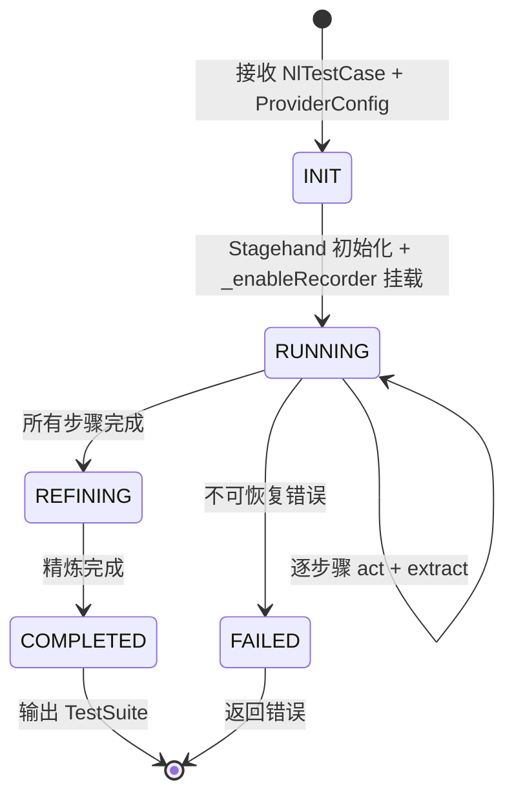

# AI-Driven Recording Engine

AI-Driven Recording Engine 基于 **Stagehand** 将自然语言测试用例（NL Test Case）转化为结构化可执行的 TestStep。Stagehand 读取 NL 指令自主操作浏览器，`_enableRecorder` 自动捕获结构化步骤，Refiner 精炼后输出生产就绪的 TestSuite。

**设计依据**：选择 Stagehand 而非自建 Agent，因为 Stagehand 内部已实现 observe→plan→execute 循环，`act()` + `extract()` 两个 API 覆盖执行与验证，且 `act()` 通过 CDP 触发的 DOM 事件可被 `_enableRecorder` 自动捕获（POC 已验证）。自建 Observer/Executor/Verify 全部多余。

---

## 1. Architecture

### 1.1 核心流程

```mermaid
graph TB
    subgraph "Server"
        API[REST API<br/>启动/查询/结果]
        DB[(DB<br/>runs + results)]
        SSE[SSE Gateway<br/>实时进度]
    end

    subgraph "Agent Client"
        WS[WS Handler<br/>指令分发]
        SESSION[AIRecordingSession]
        SH[Stagehand<br/>act + extract]
        REC[_enableRecorder<br/>自动捕获]
        REFINE[Refiner<br/>去重/断言/参数化]
    end

    subgraph "Input"
        NL[NL Test Case]
    end

    subgraph "Output"
        SUITE[TestSuite]
        TB[TestBuilder<br/>人工复核]
    end

    NL --> API
    API -->|WS: RECORDING_START<br/>nlCase + providerConfig| WS
    WS --> SESSION
    SESSION --> SH
    SH -->|CDP DOM 事件| REC
    REC -->|ActionInContext| SESSION
    SH -->|extract() 结果| SESSION
    SESSION -->|全部步骤完成| REFINE
    REFINE -->|WS: RECORDING_COMPLETE<br/>refined steps| WS
    WS -->|结果保存| API
    API --> DB
    API --> SSE
    SUITE --> TB
```

**Agent/Server 职责边界**：

| 端 | 职责 | 不做的事 |
|:---|:---|:---|
| **Server** | API 入口、DB 持久化、SSE 广播、Provider 配置管理 | 不运行 Refiner、不调 LLM、不碰浏览器 |
| **Agent** | Stagehand 执行、录制捕获、Refiner 精炼、结果回传 | 不直接暴露 REST API、不管理 DB |

### 1.2 质量模型

| 阶段 | 保障 |
|:---|:---|
| **执行期** | Stagehand `act()` 执行操作 + `extract()` 验证 expected；`_enableRecorder` 自动捕获结构化步骤 |
| **精炼期** | Refiner 纯代码管道：去重、断言映射、参数化、选择器展开 |
| **复核期** | TestBuilder 人工编辑、回放验证、审批 |

---

## 2. Pipeline

### 2.1 Recording Loop

每个 NL 步骤的执行周期：

```
对于 NL Step i: "点击登录按钮，跳转到首页"

  1. act()
     stagehand.act('点击登录按钮', { page })
     → Stagehand 内部: observe → plan → execute
     → _enableRecorder 自动捕获: TestStep { action: "click", target: "loginBtn", ... }

  2. extract()（仅当 nlStep.expected 存在时）
     stagehand.extract({
       instruction: `Verify: "${nlStep.expected}"`,
       schema: { success, assertions[] }
     })
     → 返回结构化断言，暂存供 Refiner 使用
     → 失败则重试 act()（最多 maxRetries 次）

  3. 标记 NL step 边界
     记录当前 recordedSteps 长度，用于后续断言映射
```

### 2.2 State Machine



> 重试是 `RUNNING` 状态内部的循环，不是独立状态。

---

## 3. Core Components

### 3.1 AIRecordingSession

**路径**：`agent/recorder/ai-recording-session.ts`

整个 AI 驱动录制的编排器，在 Agent 客户端进程中运行。

```typescript
interface NlStepBoundary {
  nlStepIndex: number;
  startStepIdx: number;  // 该 NL step 开始时 recordedSteps 的长度
  endStepIdx: number;    // 该 NL step 结束后 recordedSteps 的长度
}

class AIRecordingSession {
  private stagehand: Stagehand | null = null;
  private extractResults: Map<number, StructuredExtractResult> = new Map();
  private recordedSteps: TestStep[] = [];
  private stepBoundaries: NlStepBoundary[] = [];

  async start(params: {
    nlCase: NlTestCase;
    providerConfig: ProviderConfig;
    onStepRecorded: (step: TestStep) => void;
    onEvent: (event: string, data: any) => void;
  }): Promise<RecordingResult> {
    const { nlCase, providerConfig, onStepRecorded, onEvent } = params;

    // 1. 初始化 Stagehand
    this.stagehand = new Stagehand({
      env: 'LOCAL',
      verbose: 1,
      debugDom: false,
      llmProvider: buildStagehandLLMConfig(providerConfig),
    });
    await this.stagehand.init();
    const page = this.stagehand.page;
    const context = page.context();

    // 2. 挂载 _enableRecorder
    if (!PlaywrightRecorderAdapter.isAvailable(context)) {
      throw new Error('AI 驱动录制需要 Playwright >= 1.48');
    }

    const adapter = new PlaywrightRecorderAdapter({
      onActionAdded: (_page, actionInContext) => {
        const step = translateAction(actionInContext);
        if (!step) return;
        if (!step.pageUrl) step.pageUrl = _page.url();
        for (const consolidated of new StepConsolidator().add(step)) {
          this.recordedSteps.push(consolidated);
          onStepRecorded(consolidated);
        }
      },
    });
    adapter.start(context);

    // 3. 导航到起始页面
    await page.goto(nlCase.startUrl || 'about:blank');
    await page.waitForLoadState('networkidle');

    // 4. 逐步骤执行
    for (let i = 0; i < nlCase.steps.length; i++) {
      const boundary = await this.executeNlStep(i, nlCase.steps[i], onEvent);
      this.stepBoundaries.push(boundary);
    }

    // 5. Refine
    const refiner = new Refiner();
    const refinedSteps = refiner.refine(
      this.recordedSteps,
      this.stepBoundaries,
      this.extractResults,
    );

    // 6. 清理
    adapter.stop();
    await this.stagehand.close();
    this.stagehand = null;

    return { steps: refinedSteps, extractResults: this.extractResults };
  }

  private async executeNlStep(
    nlStepIndex: number,
    nlStep: NlTestCaseStep,
    emit: (event: string, data: any) => void,
  ): Promise<NlStepBoundary> {
    const maxRetries = 2;
    const page = this.stagehand!.page;
    const startStepIdx = this.recordedSteps.length;

    emit('step:start', { stepIndex: nlStepIndex, instruction: nlStep.action });

    for (let attempt = 0; attempt <= maxRetries; attempt++) {
      try {
        // Act
        await this.stagehand!.act(nlStep.action, { page });

        // Verify（仅当 expected 存在）
        if (nlStep.expected) {
          const result = await this.stagehand!.extract({
            instruction: `Verify: "${nlStep.expected}". Return structured assertions.`,
            schema: EXTRACT_ASSERTION_SCHEMA,
          });

          if (result.success) {
            this.extractResults.set(nlStepIndex, result);
            emit('step:complete', { stepIndex: nlStepIndex });
            return { nlStepIndex, startStepIdx, endStepIdx: this.recordedSteps.length };
          }

          // 验证失败，重试
          if (attempt < maxRetries) continue;
          emit('step:failed', { stepIndex: nlStepIndex, reason: 'expected not met after retries' });
          return { nlStepIndex, startStepIdx, endStepIdx: this.recordedSteps.length };
        }

        // 无 expected，直接完成
        emit('step:complete', { stepIndex: nlStepIndex });
        return { nlStepIndex, startStepIdx, endStepIdx: this.recordedSteps.length };

      } catch (err: any) {
        if (attempt < maxRetries) continue;
        emit('step:failed', { stepIndex: nlStepIndex, reason: err.message });
        return { nlStepIndex, startStepIdx, endStepIdx: this.recordedSteps.length };
      }
    }

    // 不可达，但类型安全
    return { nlStepIndex, startStepIdx, endStepIdx: this.recordedSteps.length };
  }
}
```

**关键设计**：`NlStepBoundary` 记录每个 NL step 对应的 recordedSteps 范围 `[startStepIdx, endStepIdx)`，解决 NL step 与 recorded step 非 1:1 映射的问题。

### 3.2 Refiner

**路径**：`agent/recorder/refiner.ts`

纯代码管道，不需要 LLM。

```
Raw Steps → [Deduplicator] → [AssertionMapper] → [Parameterizer] → [SelectorExpander] → Refined Steps
```

| 阶段 | 输入 | 输出 | 说明 |
|:---|:---|:---|:---|
| Deduplicator | rawSteps | 去重后的 steps | 相邻相同步骤合并 |
| AssertionMapper | steps + boundaries + extractResults | 带断言的 steps | 按 boundary 将 extract 结果映射到对应步骤组的最后一步 |
| Parameterizer | steps | 参数化的 steps | 正则识别硬编码数据（邮箱/手机/URL/ID） |
| SelectorExpander | steps | 展开选择器的 steps | 补充多策略选择器 |

```typescript
class Refiner {
  refine(
    rawSteps: TestStep[],
    boundaries: NlStepBoundary[],
    extractResults: Map<number, StructuredExtractResult>,
  ): TestStep[] {
    let steps = this.deduplicate(rawSteps);
    steps = this.mapAssertions(steps, boundaries, extractResults);
    steps = this.parameterize(steps);
    steps = this.expandSelectors(steps);
    return steps;
  }

  private mapAssertions(
    steps: TestStep[],
    boundaries: NlStepBoundary[],
    extractResults: Map<number, StructuredExtractResult>,
  ): TestStep[] {
    if (extractResults.size === 0) return steps;

    const result = [...steps];

    for (const boundary of boundaries) {
      const extractResult = extractResults.get(boundary.nlStepIndex);
      if (!extractResult?.assertions?.length) continue;

      // 断言挂载到该 NL step 对应的最后一个 recorded step
      const targetIdx = boundary.endStepIdx - 1;
      if (targetIdx < 0 || targetIdx >= result.length) continue;

      const assertions: StepAssertion[] = extractResult.assertions.map(a => ({
        id: randomId('ast'),
        source: a.source,
        operator: a.operator,
        expectedValue: a.expectedValue,
      }));

      result[targetIdx] = { ...result[targetIdx], assertions };
    }

    return result;
  }

  private parameterize(steps: TestStep[]): TestStep[] {
    const PATTERNS = [
      { pattern: /^[\w.+-]+@[\w-]+\.[\w.]+$/, varName: 'email' },
      { pattern: /^1[3-9]\d{9}$/, varName: 'phone' },
      { pattern: /^https?:\/\/.+/, varName: 'url' },
      { pattern: /^\d{8,}$/, varName: 'id' },
    ];

    return steps.map(step => {
      if (!step.data) return step;
      for (const { pattern, varName } of PATTERNS) {
        if (pattern.test(step.data)) {
          return {
            ...step,
            data: `{{${varName}}}`,
            variables: [...(step.variables || []), { name: varName, source: 'UI_VALUE', scope: 'CASE' }],
          };
        }
      }
      return step;
    });
  }
}
```

### 3.3 Recording Integration

AI 驱动模式直接使用 `PlaywrightRecorderAdapter` + `StepConsolidator`，不经过 `RecordingManager`。原因：Stagehand 管浏览器生命周期，`AIRecordingSession` 管录制流程，`RecordingManager` 的单例管理和浏览器管理都是多余的。`RecordingManager` 仅在人工录制模式下使用。

`_enableRecorder` 捕获原理：Playwright Recorder 在收到 CDP `Input.dispatchMouseEvent` 产生的 DOM 事件后，通过 accessibility tree 反向解析出 `internal:role=` 语义选择器。录制器不关注调用 API 的方式，只关注最终点到的是哪个元素。Stagehand `act()` 内部最终也通过 Playwright API 操作浏览器，走同样的 CDP 路径。

---

## 4. extract() Schema Design

`extract()` 的 schema 直接定义断言结构，LLM 返回结构化数据而非自由文本。这是断言映射零正则、零 LLM 的关键。

```typescript
const EXTRACT_ASSERTION_SCHEMA = {
  success: z.boolean(),
  assertions: z.array(z.object({
    source: z.enum([
      'UI_PAGE_URL', 'UI_TEXT',
      'UI_ELEMENT_VISIBLE', 'UI_ELEMENT_ENABLED',
    ]),
    operator: z.enum(['EQUALS', 'CONTAINS']),
    expectedValue: z.string(),
  })),
};
```

调用示例：
```typescript
const result = await stagehand.extract({
  instruction: `Verify: "${nlStep.expected}". Return structured assertions.`,
  schema: EXTRACT_ASSERTION_SCHEMA,
});
// result: { success: true, assertions: [{ source: 'UI_PAGE_URL', operator: 'CONTAINS', expectedValue: '/home' }] }
```

---

## 5. Provider Compatibility

Stagehand v3 使用 OpenAI **Responses API**（`/v1/responses`），不支持仅提供 Chat Completions API 的 Provider。

| Provider 类型 | 支持 Responses API | 可用于 AI 驱动录制 |
|:---|:---:|:---:|
| OpenAI 官方 | ✅ | ✅ |
| Azure OpenAI | ✅ | ✅ |
| 其他 OpenAI-compatible（仅 `/v1/chat/completions`） | ❌ | ❌ |

UI 限制：不支持的 Provider 显示提示，不展示 AI 驱动录制入口。

Provider 配置通过 WS 下发，Agent 内存持有，不落盘，录制结束后释放。

---

## 6. Database Schema

```sql
-- 运行记录
CREATE TABLE ai_driven_recording_runs (
  id TEXT PRIMARY KEY,
  project_id TEXT NOT NULL,
  nl_case_id TEXT NOT NULL,
  status TEXT NOT NULL DEFAULT 'running',  -- running | refining | completed | failed
  started_at TEXT NOT NULL DEFAULT (datetime('now')),
  completed_at TEXT,
  total_steps INTEGER NOT NULL DEFAULT 0,
  completed_steps INTEGER NOT NULL DEFAULT 0,
  failed_steps INTEGER NOT NULL DEFAULT 0,
  result_case_id TEXT REFERENCES test_cases(id) ON DELETE SET NULL,
  error TEXT,
  FOREIGN KEY (nl_case_id) REFERENCES natural_language_test_cases(id)
);

-- 步骤日志（每 NL step 一条，记录整体结果）
CREATE TABLE ai_driven_recording_step_logs (
  id TEXT PRIMARY KEY,
  run_id TEXT NOT NULL REFERENCES ai_driven_recording_runs(id) ON DELETE CASCADE,
  nl_step_index INTEGER NOT NULL,
  instruction TEXT NOT NULL,
  expected TEXT,                          -- NL expected 描述
  success INTEGER NOT NULL,               -- 整体是否成功（act + verify）
  assertions TEXT,                        -- extract() 返回的结构化断言（JSON）
  recorded_step_count INTEGER NOT NULL DEFAULT 0,  -- 该 NL step 捕获了多少个 recorded step
  retry_count INTEGER NOT NULL DEFAULT 0,
  duration_ms INTEGER,
  error TEXT,                             -- 失败原因
  created_at TEXT NOT NULL DEFAULT (datetime('now'))
);

CREATE INDEX idx_ai_recording_run ON ai_driven_recording_step_logs(run_id);
CREATE INDEX idx_ai_recording_status ON ai_driven_recording_runs(status);
```

---

## 7. API Design

### 7.1 REST Endpoints

```typescript
// POST /api/projects/:projectId/ai-recorder/run
interface RunRequest {
  nlCaseId: string;
  options?: {
    headless?: boolean;              // 默认 true
    maxRetriesPerStep?: number;      // 默认 2
    timeoutPerStep?: number;         // 默认 60000ms
  };
}

interface RunResponse {
  runId: string;
  status: 'started';
}

// GET /api/projects/:projectId/ai-recorder/runs/:runId
interface RunStatusResponse {
  runId: string;
  nlCaseId: string;
  status: 'running' | 'refining' | 'completed' | 'failed';
  progress: {
    total: number;
    completed: number;
    failed: number;
  };
  result?: { caseId: string; suiteId: string };
  error?: string;
}
```

### 7.2 SSE Events

```typescript
// GET /api/projects/:projectId/ai-recorder/runs/:runId/stream

interface SSEEvents {
  'run:start': { runId: string; nlCaseId: string; totalSteps: number };
  'step:start': { stepIndex: number; instruction: string };
  'step:complete': { stepIndex: number };
  'step:failed': { stepIndex: number; reason: string };
  'run:complete': { runId: string; caseId: string; suiteId: string; durationMs: number };
  'run:error': { runId: string; error: string };
}
```

### 7.3 WS Integration

在 `recording-control.ts` 中扩展 `RECORDING_START` 指令：

```typescript
if (parsed.event === 'RECORDING_START') {
  const { targetUrl, projectId, mode, nlCase, providerConfig } = parsed.data || {};

  if (mode === 'ai' && nlCase) {
    // AI 驱动模式
    const session = new AIRecordingSession();
    activeSessions.set(ws, session);

    const result = await session.start({
      nlCase,
      providerConfig,
      onStepRecorded: (step) => emitRecordingEvent(STEP_RECORDED_EVENT, { step }),
      onEvent: (event, data) => emitRecordingEvent('AI_RECORDER_EVENT', { event, data }),
    });

    emitRecordingEvent('AI_RECORDER_COMPLETE', { result });
  } else {
    // 人工录制模式（现有逻辑不变）
    recorderV2StartRecording(targetUrl, ...);
  }
}
```

---

## 8. Module Structure

```
agent/recorder/
├── index.ts                    # RecordingManager（人工录制，不变）
├── adapter.ts                  # PlaywrightRecorderAdapter（不变）
├── consolidation.ts            # StepConsolidator（不变）
├── translator.ts               # translateAction（不变）
├── protocol.ts                 # 类型定义（不变）
├── locator.ts                  # locator 工具（不变）
├── ai-recording-session.ts     # AI 驱动录制会话（新增）
├── refiner.ts                  # Refiner 纯代码管道（新增）
└── __tests__/

server/modules/ai-driven-recorder/
├── index.ts                    # 模块入口
├── controller.ts               # REST API
├── schema.ts                   # Zod Schema
└── repository.ts               # DB 读写
```

---

## 9. Integration with Existing Modules

| 模块 | 集成方式 |
|:---|:---|
| **AI Test Gen** | 产出的 `NlTestCase` 作为本模块输入 |
| **Recording Engine** | 复用 `PlaywrightRecorderAdapter` + `StepConsolidator` + `translateAction` |
| **Element Repository** | 录制过程中自动建立/更新（与人工录制一致） |
| **Test Builder** | 精炼后的 TestSuite 直接进入 TestBuilder 人工复核 |
| **SSE Gateway** | 复用 SSE 推送方案 |
| **Provider Configs** | 复用 LLM 配置；需检查是否支持 Responses API |
| **Execution Engine** | 生成的 `TestStep[]` 可直接被 `UIExecutor` 执行 |

---

## 10. Risks & Mitigations

| 风险 | 严重度 | 缓解措施 |
|:---|:---|:---|
| Stagehand act() 选错元素 | High | extract() 验证 expected + 自动重试 + TestBuilder 人工复核 |
| Stagehand 依赖 Responses API | High | UI 限制：仅 Azure OpenAI / OpenAI 官方可用 |
| extract() schema 返回不稳定 | Medium | schema validation，不合法时降级为无断言 |
| 动态页面/异步渲染 | Medium | Stagehand 内部等待机制 + act() 前 waitForLoadState |
| iframe / Shadow DOM | Medium | Stagehand v3 支持 iframe；复杂 Shadow DOM 需人工补充 |
| `_enableRecorder` 私有 API | Medium | 启动时 isAvailable() 检测；该 API 自 1.48 起稳定存在 |
| LLM 调用成本 | Low | 每步 2 次 LLM（act + extract）；Refiner 不调 LLM |
| 密码/敏感数据暴露 | High | password 类输入框的值由 Refiner 自动提取为变量 |

---

## 11. Roadmap

| Phase | 交付 | 依赖 | 工期 |
|:---|:---|:---:|:---:|
| **P0-1** | AIRecordingSession：Stagehand 集成 + act/extract 循环 + _enableRecorder 挂载 + WS 指令 | 无 | 2 周 |
| **P0-2** | Refiner 纯代码管道：去重 → 断言映射 → 参数化 → 选择器展开 | P0-1 | 1 周 |
| **P0-3** | Provider 兼容性检查 + UI 限制 | 无 | 3 天 |
| **P1-1** | 前端集成：SSE 实时进度 + 运行历史 + TestBuilder 跳转 | P0 | 1 周 |
| **P1-2** | 健壮性：步骤级 checkpoint + 复杂交互支持 + schema validation | P0 | 1-2 周 |
| **P2** | 批量录制 + 并发控制 + 浏览器资源池 | P1 | 1 周 |
