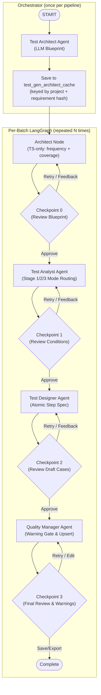

# Implementation Plan: 4-Agent Memory Pipeline & By-Batch Visualization

## Overview
This document specifies the technical execution plan for implementing an **Agent Memory Pipeline** and **By-Batch Level State Visualization** in the AI test generation workspace. 

Following the user requirements, the entry node has been refactored into a full **Test Architect Agent** (expanding the system to a 4-agent flow), introducing **Checkpoint 0 (Review Blueprint)** for human-in-the-loop review. The Quality node's Step Atomicity Gate is updated to issue **validation warnings** instead of hard rejects, allowing edits during final review. Finally, a database-purging strategy is introduced to clean and rebuild coverage history.

---

## Architecture Decisions

### 1. The 4-Agent Lifecycle Flow
The execution topology has four core agent nodes and four human review checkpoints. The Test Architect Agent runs **once at the Orchestrator level** (before the batch loop), while the remaining three agents run per-batch inside the LangGraph:

- **Test Architect Agent (Orchestrator-level)**: Runs once before any batch enters the graph. Uses LLM to generate the `GlobalTestBlueprint`. Result is cached in `test_gen_architect_cache` by `(project_id, requirement_hash)`. On re-runs with unchanged requirements, the cached blueprint is loaded without any LLM call.
- **Architect Node (Per-batch)**: Simplified to deterministic TS only (frequency scanning, coverage snapshot). Blueprint is already in `state.globalBlueprint` from the orchestrator — fast path, no LLM.
- **Checkpoint 0 (Human-in-the-loop)**: Suspends pipeline execution in Interactive Mode, allowing the user to view, edit, or override the generated `Global Test Blueprint` before Analyst conditions are formulated.
- **Test Analyst Agent (Agent 2)**: Generates conditions based on active mode (Requirements, Flows, Error-Guessing).
- **Checkpoint 1**: Review and edit Test Conditions.
- **Test Designer Agent (Agent 3)**: Transforms conditions into Playwright/Stagehand atomic steps.
- **Checkpoint 2**: Review and edit Draft Test Cases.
- **Quality Manager Agent (Agent 4)**: Computes coverage and validates step atomicity.
- **Checkpoint 3**: Final review. Step atomicity violations are flagged as warnings, enabling inline corrections.

### 2. Warning-and-Edit Gate (Checkpoint 3)
Instead of aborting execution when step atomicity rules are violated (e.g. containing conjunctions like "and" or "while"), the Quality Manager registers validation warnings (e.g., `validationWarnings: [{ stepIndex: 1, issue: "Compound step" }]`). The UI highlights these steps at Checkpoint 3, prompting the user to edit and resolve them manually.

### 3. Database Coverage Purge Strategy
To support clean restarts and invalidation when requirements undergo massive modifications:
- Provide a clean-up transaction `pipelineRepo.clearProjectCoverage(projectId)` to clear historical coverage matrix entries.
- Expose this via a "Reset Coverage" button in the Project Settings page and a "Clean Start" checkbox in the Test Generation Launch modal.

---

## Detailed Task List

### Phase 1: Database Setup & Purge Strategy

#### Task 1.1: Database Migration for Persistent Coverage
- **Description**: Add the `test_gen_persistent_coverage` schema to SQLite.
- **Acceptance criteria**:
  - [ ] Migration creates `test_gen_persistent_coverage` table with unique constraint on `(project_id, requirement_id, condition_hash, technique)`.
- **Verification**:
  - [ ] Run migration and inspect schema using SQLite CLI.
- **Dependencies**: None
- **Files likely touched**:
  - `server/migrations/001_agent_memory.ts` (or next sequence file)
  - `server/migrations/index.ts`
- **Estimated scope**: XS (1-2 files)

#### Task 1.2: Repository Layer CRUD and Purge Execution
- **Description**: Add queries to read, write, and purge coverage matrix entries.
- **Acceptance criteria**:
  - [ ] Implement `pipelineRepo.getProjectCoverage(projectId)` to fetch historical rows.
  - [ ] Implement `pipelineRepo.upsertCoverageEntries(runId, projectId, cases)` for bulk updates.
  - [ ] Implement `pipelineRepo.clearProjectCoverage(projectId)` to clear coverage rows for a project.
- **Verification**:
  - [ ] Run repository unit tests to confirm tables can be cleared and filled successfully.
- **Dependencies**: Task 1.1
- **Files likely touched**:
  - `server/modules/ai-test-gen/repository.ts`
- **Estimated scope**: S (1 file)

---

### Checkpoint 1: Database and Reset Logic Complete
- [ ] Database structures successfully initialized.
- [ ] Reset database routines verified.

---

### Phase 2: Graph Refactoring (4-Agent Flow)

#### Task 2.1: Graph State Extensions (Checkpoint 0 Support)
- **Description**: Add `checkpoint_0` keys and refactor `TestGenState` to support the new Architect phase.
- **Acceptance criteria**:
  - [ ] Update `TestGenStateAnnotation` in `graph/state.ts` to include `globalBlueprint`, `coverageSnapshot`, `analystMode`.
  - [ ] Update `CHECKPOINT_BY_PHASE` to register `'review-blueprint': 0`.
  - [ ] Update `PHASE_BY_CHECKPOINT` to map `0: 'review-blueprint'`.
  - [ ] Update `AGENT_NAME_BY_CHECKPOINT` to map `0: 'test_architect'`.
- **Verification**:
  - [ ] Compile and verify there are no TypeScript syntax errors in `state.ts`.
- **Dependencies**: Task 1.2
- **Files likely touched**:
  - `server/modules/ai-test-gen/graph/state.ts`
- **Estimated scope**: S (1 file)

#### Task 2.2: Test Architect Agent (Orchestrator-Level Global Blueprint)
- **Description**: The LLM-driven Architect moves OUT of the per-batch graph and runs **once per pipeline execution** in the Orchestrator (`orchestrator.ts`). The per-batch `architect.ts` (原 `preparation.ts`) node is simplified to only run deterministic TS (frequency scan, coverage snapshot) — the blueprint arrives pre-populated in `state.globalBlueprint` from the orchestrator.
- **Key design changes**:
  - New `ensureGlobalBlueprint()` method in `Orchestrator` class checks `test_gen_architect_cache` by `(projectId, requirementHash)` before calling the LLM.
  - Requirement hash = SHA-256 of all selected requirement IDs + content + flow IDs. Any requirement edit invalidates the cache.
  - New migration `003_architect_cache.ts` creates the `test_gen_architect_cache` table.
  - `forceArchitect?: boolean` added to `StartParams` and `StartConfig` to skip cache on re-run.
  - `architect.ts` (原 `preparation.ts`) retains the LLM fallback for the `forceRedesign` edge case (checkpoint 0 retry).
- **Acceptance criteria**:
  - [ ] On first run, Orchestrator generates blueprint once before batch loop; all batches receive the same blueprint.
  - [ ] On re-run with unchanged requirements, Orchestrator loads blueprint from `test_gen_architect_cache` (zero LLM calls).
  - [ ] On re-run with changed requirements or `forceArchitect=true`, Orchestrator re-generates blueprint and updates cache.
- **Verification**:
  - [ ] Verify via server logs: single "Architect: cache MISS" log line, followed by batch loops with no additional architect LLM calls.
  - [ ] Run twice with same requirements: second run shows "Architect: cache HIT" in logs.
- **Dependencies**: Task 2.1, new migration 003
- **Files likely touched**:
  - `server/modules/ai-test-gen/orchestrator.ts` (new `ensureGlobalBlueprint()` method, modified `start()` flow)
  - `server/modules/ai-test-gen/graph/nodes/architect.ts` (原 `preparation.ts` — remove LLM generation, simplify to deterministic only)
  - `server/modules/ai-test-gen/repository.ts` (add `getCachedBlueprint`, `saveCachedBlueprint`, `deleteCachedBlueprint`, `clearProjectArchitectCache`)
  - `server/modules/ai-test-gen/context.ts` (add `forceArchitect` to `StartParams`)
  - `client/shared/test-gen-run/types.ts` (add `forceArchitect` to `StartConfig`)
  - `server/migrations/003_architect_cache.ts` (new migration file)
- **Estimated scope**: L (6 files)

#### Task 2.3: Checkpoint 0 Node Integration in LangGraph
- **Description**: Implement `checkpoint0` node in `checkpoints.ts` and add it to the graph compilation topology.
- **Acceptance criteria**:
  - [ ] Register `checkpoint_0` in `graph.ts` as an interrupt checkpoint.
  - [ ] Add `checkpoint_0` payload wrapping `state.globalBlueprint` in `checkpoints.ts`.
  - [ ] Handle retry actions by looping back to the Architect node.
- **Verification**:
  - [ ] Verify that starting the pipeline in interactive mode halts at Checkpoint 0.
- **Dependencies**: Task 2.2
- **Files likely touched**:
  - `server/modules/ai-test-gen/graph/graph.ts`
  - `server/modules/ai-test-gen/graph/nodes/checkpoints.ts`
- **Estimated scope**: M (2 files)

#### Task 2.4: Step Warning Gate in Quality Agent
- **Description**: Update Quality Manager to append warnings to final test steps instead of hard-failing the graph.
- **Acceptance criteria**:
  - [ ] Search final test steps for non-atomic keywords ("and", "while").
  - [ ] Populate `validationWarnings` list within the test cases structure if atomic checks fail.
  - [ ] Upsert successfully approved matrix rows into the persistent DB on batch completion.
- **Verification**:
  - [ ] Trigger Quality review with compound steps and verify cases continue to Checkpoint 3 but list warnings.
- **Dependencies**: Task 2.1
- **Files likely touched**:
  - `server/modules/ai-test-gen/graph/nodes/quality.ts`
- **Estimated scope**: S (1 file)

---

### Checkpoint 2: LangGraph 4-Agent Pipeline Verified
- [ ] Pipeline runs through Architect → Checkpoint 0 → Analyst → Checkpoint 1 → Designer → Checkpoint 2 → Quality → Checkpoint 3.
- [ ] Warning data is appended and passes successfully to Checkpoint 3.

---

### Phase 3: APIs and Client Reducer Upgrades

#### Task 3.1: API Endpoints for Checkpoint 0 and Purge Controls
- **Description**: Add API controllers to support clearing project coverage and editing checkpoint 0 blueprint payloads.
- **Acceptance criteria**:
  - [ ] Create API endpoint `POST /api/test-gen/projects/:projectId/clear-coverage`.
  - [ ] Update controller's `getCheckpointState` and `saveCheckpointEdits` to support `checkpointNumber: 0`.
- **Verification**:
  - [ ] Perform REST requests and confirm database tables and checkpoint 0 payloads update correctly.
- **Dependencies**: Task 2.3, Task 1.2
- **Files likely touched**:
  - `server/modules/ai-test-gen/controller.ts`
  - `client/shared/services/api.ts`
- **Estimated scope**: S (2 files)

#### Task 3.2: Batch-Filtered APIs & SSE Events
- **Description**: Support fetching logs/thinking traces filtered by `?batch=N` and include `batch` inside SSE event payloads.
- **Acceptance criteria**:
  - [ ] Update `/api/test-gen/:runId/logs` and `/thinking` endpoints to filter results by batch index.
  - [ ] Update `scope.ts` so `agent:thinking` and audit logs stream and save with batch numbers.
- **Verification**:
  - [ ] Execute stream listener and confirm `batch` property is present on the logged objects.
- **Dependencies**: Task 2.3
- **Files likely touched**:
  - `server/modules/ai-test-gen/scope.ts`
  - `server/modules/ai-test-gen/repository.ts`
- **Estimated scope**: S (2 files)

#### Task 3.3: Client Reducer Updates for Checkpoint 0 and Batch State
- **Description**: Update the client-side reducer to support 4 agent phases, Checkpoint 0, and batch filtering.
- **Acceptance criteria**:
  - [ ] Add `selectedBatch: number | 'all'` to client types.
  - [ ] Add `checkpoint_0` to client node layouts and define phase transitions.
  - [ ] Modify `MERGE_AGENT_LOGS` to correctly categorize logs and thinking by batch.
- **Verification**:
  - [ ] Build client project and ensure reducer compiles cleanly.
- **Dependencies**: Task 3.2, Task 3.1
- **Files likely touched**:
  - `client/shared/test-gen-run/types.ts`
  - `client/shared/test-gen-run/test-gen-reducer.ts`
  - `client/shared/test-gen-run/useTestGenRun.ts`
- **Estimated scope**: M (3 files)

---

### Checkpoint 3: Client and Server API Connection Ready
- [ ] API successfully handles Blueprint (Checkpoint 0) state editing.
- [ ] Client reducer stores logs by batch index without leakage.

---

### Phase 4: Frontend UI Engineering

#### Task 4.1: Batch Tab Bar in Detail Panel
- **Description**: Add a batch tab bar at the top of `TestGenDetailPanel.tsx` so users can switch between "All Batches" and individual execution batches without leaving the detail view. This replaces a dedicated sidebar, keeping the existing 2-column layout (Stepper + Detail Panel) intact.
- **Rationale**: Tab-based batch switching is more standard than a sidebar — it preserves Stepper width, maps naturally to the content area, and avoids a third column in the Runtime layout.
- **Acceptance criteria**:
  - [ ] Render a horizontal tab bar inside the Detail Panel header: `[All Batches] [Epic A ⏳] [Epic B ✓] [Epic C ▶]`
  - [ ] Each tab shows the Epic name with a status indicator icon (⏳ waiting / ✓ done / ▶ running / ○ pending / 🔴 error).
  - [ ] "All Batches" tab is the default, showing an aggregate summary of all batches (coverage totals, per-batch mini status list).
  - [ ] Selecting an individual batch tab filters the Detail Panel content to that batch only (logs, thinking timeline, results, checkpoint data).
  - [ ] Stepper on the left updates to reflect the currently selected batch's phase/node status.
  - [ ] Batches waiting for human checkpoint review are visually highlighted (pulsing amber dot on tab).
- **Verification**:
  - [ ] Click each batch tab and verify logs, thinking, and results panel switch instantly.
  - [ ] Verify "All Batches" view compiles coverage and status across all batches correctly.
- **Dependencies**: Task 3.3
- **Files likely touched**:
  - `client/features/ai-test-gen/TestGenDetailPanel.tsx` (new tab bar + batch-aware content switching)
  - `client/shared/test-gen-run/types.ts` (add `selectedBatch` field if not added in 3.3)
  - `client/features/ai-test-gen/AiTestGenPage.tsx` (pass batch state through, no layout change)
- **Estimated scope**: M (2-3 files)

#### Task 4.2: Blueprint Review Panel (Checkpoint 0)
- **Description**: Build an editor panel for Checkpoint 0 displaying the Global Test Blueprint.
- **Acceptance criteria**:
  - [ ] Render blueprint details (business paths, risk epic trees, anomalous flow proposals) as markdown.
  - [ ] Allow editing the blueprint configuration in a text editor before approving.
- **Verification**:
  - [ ] Open Checkpoint 0, edit the text, click "Approve", and ensure edits reach the backend state.
- **Dependencies**: Task 4.1
- **Files likely touched**:
  - `client/features/ai-test-gen/TestGenDetailPanel.tsx`
- **Estimated scope**: M (1 file)

#### Task 4.3: Warnings and Edit Console (Checkpoint 3)
- **Description**: Update Checkpoint 3 panel to display step atomicity warnings and provide step-level editing controls.
- **Acceptance criteria**:
  - [ ] Flag steps with warnings in yellow/orange banners.
  - [ ] Provide inputs on each flagged step to edit descriptions inline before finalizing the export.
- **Verification**:
  - [ ] Input edit, verify warning disappears, and final test case changes persist to the DB.
- **Dependencies**: Task 4.2
- **Files likely touched**:
  - `client/features/ai-test-gen/TestGenDetailPanel.tsx`
  - `client/features/ai-test-gen/TestGenStepper.tsx`
- **Estimated scope**: M (2 files)

---

### Checkpoint 4: Full End-to-End System Complete
- [ ] 4-Agent pipeline executes seamlessly in interactive mode.
- [ ] Users can edit/approve Global Blueprints, see warnings on non-atomic steps, edit final steps, and run database purge strategies.

---

## Risks and Mitigations

| Risk | Impact | Mitigation |
| :--- | :--- | :--- |
| **Blueprint complexity overrides client rendering performance** | Medium | Paginate or use tree collapsing on epic nodes when displaying the blueprint DAG. |
| **Simultaneous batch runs blocking SQLite database queries** | High | Run SQLite updates in serialized transaction modes. |
| **Step atomicity checks blocking valid custom domains** | Low | Enable warning override, so warnings don't block the export process if user approves them. |
