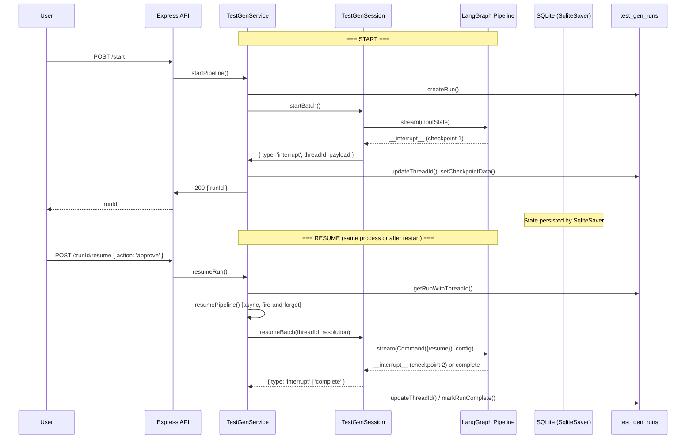

# Refactor HITL Checkpoint Resume to LangGraph Best Practices

> **For agentic workers:** REQUIRED SUB-SKILL: Use superpowers:subagent-driven-development (recommended) or superpowers:executing-plans to implement this plan task-by-task. Steps use checkbox (`- [ ]`) syntax for tracking.

**Goal:** Refactor checkpoint interrupt/resume so runs survive server restarts and human intervention works reliably via database-persisted state instead of in-memory Promises.

**Architecture:** Replace the in-memory `Promise`-based `InteractiveResolver` with a database-driven, fire-and-forget pattern. Each batch creates a LangGraph `thread_id` stored in `test_gen_runs`. On interrupt, the graph state is already persisted by `SqliteSaver`; we return control to the caller immediately. On resume (user action or service restart), we rebuild the pipeline and invoke `Command({ resume })` with the stored `thread_id`. This decouples human latency from process lifetime entirely.

**Tech Stack:** TypeScript, LangGraph (`@langchain/langgraph`), `@langchain/langgraph-checkpoint-sqlite`, SQLite (better-sqlite3), Express, SSE

---

## Problem Analysis

### Current Architecture (Broken)

```
TestGenSession.runBatch() → while(true) loop:
  pipeline.stream(inputState) → interrupt fires → __interrupt__ in state
  InteractiveResolver.resolve() → blocks on Promise (IN MEMORY!)
  user resumes → Promise resolves → loop continues → pipeline.stream(Command({resume}))
```

**Failure modes:**
1. **Server restart during WAITING_REVIEW** → in-memory Promise map is empty → run is orphaned, cannot resume
2. **Single-checkpoint-per-run limitation** → `resumeWaiters` keyed by `runId`, only one pending waiter per run
3. **thread_id not persisted** → cannot reconstruct LangGraph config after restart
4. **Session state in memory** → `lastStates` Map lost on restart

### Target Architecture (Correct LangGraph Pattern)

```
startBatch():
  create thread_id → pipeline.stream(inputState, config) → interrupt fires
  → store thread_id + checkpoint_data in DB → set status=WAITING_REVIEW → RETURN

resumeBatch(thread_id, decision):
  rebuild pipeline → pipeline.stream(Command({resume: decision}), config)
  → if interrupt again → store new checkpoint → set WAITING_REVIEW → RETURN
  → if complete → set COMPLETED → RETURN
```

**Key principle:** Each graph invocation is stateless. State lives in the checkpointer (SQLite). The `thread_id` is the durable recovery key.

---

## File Map

| File | Action | Responsibility |
|------|--------|---------------|
| `server/migrations/022_add_thread_id.ts` | Create | Add `thread_id` column to `test_gen_runs` |
| `server/modules/ai-test-gen/infrastructure/db/test-gen-repository.ts` | Modify | Add `getRunByThreadId()`, `getWaitingRuns()`, `updateThreadId()` |
| `server/modules/ai-test-gen/application/checkpoint-resolver.ts` | Rewrite | Remove in-memory Promises; `resolve()` returns immediately after persisting |
| `server/modules/ai-test-gen/application/test-gen-session.ts` | Rewrite | Split `runBatch()` into `startBatch()` + `resumeBatch()`; no while loop |
| `server/modules/ai-test-gen/application/test-gen-service.ts` | Modify | `resumeRun()` rebuilds pipeline + invokes with `Command({resume})`; add `recoverInterruptedRuns()` |
| `server/modules/ai-test-gen/__tests__/checkpoint-resolver.test.ts` | Rewrite | Test new non-blocking resolver |
| `server/modules/ai-test-gen/__tests__/test-gen-session.test.ts` | Create | Test start/resume split |
| `server/app/startServer.ts` | Modify | Call `recoverInterruptedRuns()` on startup |

---

## Task 1: Add `thread_id` column to `test_gen_runs`

**Files:**
- Create: `server/migrations/022_add_thread_id.ts`
- Modify: `server/migrations/index.ts`

- [ ] **Step 1: Create migration file**

```typescript
// server/migrations/022_add_thread_id.ts
import { db } from '../shared/db/client.ts';
import type { Migration } from './types.ts';

export const migration022ThreadId: Migration = {
  id: '022_add_thread_id',
  up: () => {
    db.exec(`
      ALTER TABLE test_gen_runs ADD COLUMN thread_id TEXT;
      CREATE INDEX IF NOT EXISTS idx_test_gen_runs_thread_id ON test_gen_runs(thread_id);
      CREATE INDEX IF NOT EXISTS idx_test_gen_runs_status ON test_gen_runs(status);
    `);
  },
};
```

- [ ] **Step 2: Register migration**

Read `server/migrations/index.ts` and add the new migration to the array.

- [ ] **Step 3: Run migration**

```bash
npm run migrate
```

Expected: Migration `022_add_thread_id` runs successfully.

- [ ] **Step 4: Commit**

```bash
git add server/migrations/022_add_thread_id.ts server/migrations/index.ts
git commit -m "feat: add thread_id column to test_gen_runs for HITL resume"
```

---

## Task 2: Update repository with thread_id and waiting-run queries

**Files:**
- Modify: `server/modules/ai-test-gen/infrastructure/db/test-gen-repository.ts`

- [ ] **Step 1: Add `updateThreadId()` method**

Add to `TestGenRepository` class:

```typescript
updateThreadId(runId: string, threadId: string): void {
  db.prepare("UPDATE test_gen_runs SET thread_id = ?, updated_at = datetime('now') WHERE id = ?")
    .run(threadId, runId);
}
```

- [ ] **Step 2: Add `getWaitingRuns()` method**

```typescript
getWaitingRuns(): any[] {
  const rows = db.prepare(
    "SELECT id, project_id, status, phase, thread_id, mode, config, checkpoint_data FROM test_gen_runs WHERE status = 'WAITING_REVIEW' AND thread_id IS NOT NULL"
  ).all();
  return (rows as any[]).map(r => ({
    ...r,
    config: r.config ? JSON.parse(r.config) : null,
    checkpoint_data: r.checkpoint_data ? JSON.parse(r.checkpoint_data) : null,
  }));
}
```

- [ ] **Step 3: Add `getRunWithThreadId()` method**

```typescript
getRunWithThreadId(runId: string): any {
  const row = db.prepare(
    'SELECT id, project_id, status, phase, thread_id, mode, config, checkpoint_data FROM test_gen_runs WHERE id = ?'
  ).get(runId) as any;
  if (!row) return null;
  return {
    ...row,
    config: row.config ? JSON.parse(row.config) : null,
    checkpoint_data: row.checkpoint_data ? JSON.parse(row.checkpoint_data) : null,
  };
}
```

- [ ] **Step 4: Update `TestGenRunRow` interface**

Add `thread_id` to the interface:

```typescript
export interface TestGenRunRow {
  // ... existing fields ...
  thread_id: string | null;
}
```

- [ ] **Step 5: Run lint**

```bash
npm run lint
```

Expected: No type errors.

- [ ] **Step 6: Commit**

```bash
git add server/modules/ai-test-gen/infrastructure/db/test-gen-repository.ts
git commit -m "feat: add thread_id persistence and waiting-run queries to repository"
```

---

## Task 3: Rewrite `InteractiveResolver` to be non-blocking

**Files:**
- Modify: `server/modules/ai-test-gen/application/checkpoint-resolver.ts`
- Modify: `server/modules/ai-test-gen/__tests__/checkpoint-resolver.test.ts`

- [ ] **Step 1: Rewrite `CheckpointResolver` interface and `InteractiveResolver`**

The resolver no longer blocks. `resolve()` persists checkpoint data, emits SSE, and returns a `Promise<CheckpointResolution>` that is **resolved externally** when `resumeRun()` is called. But critically, `resolve()` itself returns immediately — the blocking is handled by the caller (session) which returns from `runBatch()`.

Actually, the cleanest approach: `resolve()` returns a `CheckpointResolution` synchronously (or as a resolved promise) after persisting. The session loop **breaks out** when interrupt is detected, and resume is a separate call.

New interface:

```typescript
import type { SSEGateway } from '../infrastructure/sse/sse-gateway.ts';

export interface CheckpointResolution {
  action: 'approve' | 'retry';
  feedback?: string;
  edits?: Record<string, unknown>;
}

export interface CheckpointResolver {
  /** Called when graph hits interrupt. Persists checkpoint and returns resolution info. */
  onInterrupt(
    runId: string,
    checkpointNumber: number,
    phase: string,
    payload: Record<string, unknown>,
  ): void;
}

export class AutoResolver implements CheckpointResolver {
  onInterrupt(
    _runId: string,
    _checkpointNumber: number,
    _phase: string,
    _payload: Record<string, unknown>,
  ): void {
    // Auto-approve: no-op, caller handles auto-resume
  }
}

export class InteractiveResolver implements CheckpointResolver {
  constructor(
    private readonly saveCheckpoint: (runId: string, data: unknown, phase: string) => void,
    private readonly sseGateway: SSEGateway,
  ) {}

  onInterrupt(
    runId: string,
    checkpointNumber: number,
    phase: string,
    payload: Record<string, unknown>,
  ): void {
    this.saveCheckpoint(runId, payload, phase);

    this.sseGateway.emit(runId, 'checkpoint:waiting', {
      checkpointId: `${runId}-cp-${checkpointNumber}`,
      checkpointNumber,
      type: phase,
      summary: checkpointNumber === 1
        ? `${(payload as any)?.conditions?.length || 0} Test Conditions`
        : checkpointNumber === 2
          ? `${(payload as any)?.cases?.length || 0} Draft Cases`
          : 'Final Review',
      payload,
    });
  }
}
```

- [ ] **Step 2: Rewrite tests**

```typescript
import { describe, expect, it, vi, beforeEach } from 'vitest';
import { AutoResolver, InteractiveResolver } from '../application/checkpoint-resolver.ts';

function mockSSEGateway() {
  return {
    emit: vi.fn(),
    getEmitter: vi.fn(() => ({ listenerCount: vi.fn(() => 0) })),
  } as any;
}

describe('AutoResolver', () => {
  it('onInterrupt is a no-op', () => {
    const resolver = new AutoResolver();
    expect(() => resolver.onInterrupt('run-1', 1, 'review-conditions', {})).not.toThrow();
  });
});

describe('InteractiveResolver', () => {
  let saveCheckpoint: ReturnType<typeof vi.fn>;
  let sse: ReturnType<typeof mockSSEGateway>;
  let resolver: InteractiveResolver;

  beforeEach(() => {
    saveCheckpoint = vi.fn();
    sse = mockSSEGateway();
    resolver = new InteractiveResolver(saveCheckpoint, sse);
  });

  it('saves checkpoint data and emits SSE event on interrupt', () => {
    const payload = { conditions: [{ id: 'c1' }] };
    resolver.onInterrupt('run-1', 1, 'review-conditions', payload);

    expect(saveCheckpoint).toHaveBeenCalledWith('run-1', payload, 'review-conditions');
    expect(sse.emit).toHaveBeenCalledWith('run-1', 'checkpoint:waiting', expect.objectContaining({
      checkpointNumber: 1,
      summary: '1 Test Conditions',
    }));
  });

  it('emits correct summary for checkpoint 2', () => {
    resolver.onInterrupt('run-1', 2, 'review-draft', { cases: [{ id: 'c1' }, { id: 'c2' }] });
    expect(sse.emit).toHaveBeenCalledWith('run-1', 'checkpoint:waiting', expect.objectContaining({
      summary: '2 Draft Cases',
    }));
  });

  it('emits correct summary for checkpoint 3', () => {
    resolver.onInterrupt('run-1', 3, 'final-review', {});
    expect(sse.emit).toHaveBeenCalledWith('run-1', 'checkpoint:waiting', expect.objectContaining({
      summary: 'Final Review',
    }));
  });
});
```

- [ ] **Step 3: Run tests**

```bash
npx vitest run server/modules/ai-test-gen/__tests__/checkpoint-resolver.test.ts
```

Expected: All tests pass.

- [ ] **Step 4: Commit**

```bash
git add server/modules/ai-test-gen/application/checkpoint-resolver.ts server/modules/ai-test-gen/__tests__/checkpoint-resolver.test.ts
git commit -m "refactor: make InteractiveResolver non-blocking for HITL pattern"
```

---

## Task 4: Rewrite `TestGenSession` with start/resume split

**Files:**
- Modify: `server/modules/ai-test-gen/application/test-gen-session.ts`
- Create: `server/modules/ai-test-gen/__tests__/test-gen-session.test.ts`

- [ ] **Step 1: Rewrite `TestGenSession`**

The session no longer has a while loop. `startBatch()` runs until interrupt, persists thread_id, returns. `resumeBatch()` rebuilds pipeline and invokes with `Command({resume})`.

```typescript
import { Command } from '@langchain/langgraph';
import type { Phase } from './phase-machine.ts';
import type { CheckpointResolver } from './checkpoint-resolver.ts';

export interface SessionOptions {
  mode: 'auto' | 'interactive';
  onEvent?: (event: string, data: unknown) => void;
  signal?: AbortSignal;
}

export interface BatchResult {
  batchIndex: number;
  cases: unknown[];
  tokenUsage: { input: number; output: number; total: number };
  lastState: Record<string, unknown>;
}

export interface InterruptInfo {
  threadId: string;
  checkpointNumber: number;
  phase: string;
  payload: Record<string, unknown>;
}

function buildResumeState(
  checkpointNumber: number,
  resolution: { action: string; feedback?: string; edits?: Record<string, unknown> },
  originalPayload: Record<string, unknown>,
): Record<string, unknown> {
  if (resolution.action === 'retry') {
    return { retry: true, feedback: resolution.feedback ?? '' };
  }
  const edits = resolution.edits ?? {};
  switch (checkpointNumber) {
    case 1:
      return {
        conditions: (edits as any).conditions ?? originalPayload.conditions,
        analysis: (edits as any).analysis ?? originalPayload.analysis,
        feedback: resolution.feedback ?? '',
      };
    case 2:
      return {
        cases: (edits as any).cases ?? originalPayload.cases,
        feedback: resolution.feedback ?? '',
      };
    case 3:
      return {
        cases: (edits as any).cases ?? originalPayload.cases,
        matrix: (edits as any).matrix ?? originalPayload.matrix,
      };
    default:
      throw new Error(`Unknown checkpoint number: ${checkpointNumber}`);
  }
}

function detectCheckpointNumber(payload: Record<string, unknown>): number {
  if ('conditions' in payload) return 1;
  if ('matrix' in payload) return 3;
  return 2;
}

function detectPhase(cpNum: number): Phase {
  switch (cpNum) {
    case 1: return 'review-conditions';
    case 2: return 'review-draft';
    case 3: return 'final-review';
    default: throw new Error(`Unknown checkpoint: ${cpNum}`);
  }
}

export class TestGenSession {
  private aborted = false;

  constructor(
    private readonly runId: string,
    private readonly pipelineFactory: () => Promise<any>,
    private readonly checkpointResolver: CheckpointResolver,
    private readonly options: SessionOptions,
  ) {}

  /**
   * Start a batch: run the pipeline until first interrupt or completion.
   * Returns BatchResult on completion, or InterruptInfo on interrupt.
   */
  async startBatch(
    batchIndex: number,
    inputState: Record<string, unknown>,
    onThreadId?: (threadId: string) => void,
  ): Promise<{ type: 'complete'; result: BatchResult } | { type: 'interrupt'; interrupt: InterruptInfo }> {
    const threadId = `${this.runId}-batch-${batchIndex}`;
    onThreadId?.(threadId);
    const config = { configurable: { thread_id: threadId } };

    const pipeline = await this.pipelineFactory();
    const stream = await pipeline.stream(inputState, { ...config, streamMode: 'values' as const });

    let lastState: any = null;
    try {
      for await (const chunk of stream) {
        if (this.aborted || this.options.signal?.aborted) return { type: 'interrupt', interrupt: { threadId, checkpointNumber: 0, phase: 'aborted', payload: {} } };
        lastState = chunk;
      }
    } catch (err: any) {
      if (this.aborted || this.options.signal?.aborted) return { type: 'interrupt', interrupt: { threadId, checkpointNumber: 0, phase: 'aborted', payload: {} } };
      throw err;
    }

    const interruptValue = (lastState as any)?.__interrupt__;
    if (interruptValue?.length > 0) {
      const payload = interruptValue[0].value as Record<string, unknown>;
      const cpNum = detectCheckpointNumber(payload);
      const phase = detectPhase(cpNum);

      this.checkpointResolver.onInterrupt(this.runId, cpNum, phase, payload);

      return {
        type: 'interrupt',
        interrupt: { threadId, checkpointNumber: cpNum, phase, payload },
      };
    }

    if (lastState) {
      const result: BatchResult = {
        batchIndex,
        cases: (lastState.finalTestCases ?? []) as unknown[],
        tokenUsage: {
          input: lastState.tokenUsage?.prompt_tokens ?? 0,
          output: lastState.tokenUsage?.completion_tokens ?? 0,
          total: (lastState.tokenUsage?.prompt_tokens ?? 0) + (lastState.tokenUsage?.completion_tokens ?? 0),
        },
        lastState,
      };
      return { type: 'complete', result };
    }

    return { type: 'complete', result: { batchIndex, cases: [], tokenUsage: { input: 0, output: 0, total: 0 }, lastState: {} } };
  }

  /**
   * Resume a batch from an interrupt. Uses the stored thread_id.
   * Returns BatchResult on completion, or InterruptInfo on next interrupt.
   */
  async resumeBatch(
    batchIndex: number,
    threadId: string,
    resolution: { action: string; feedback?: string; edits?: Record<string, unknown> },
    originalPayload: Record<string, unknown>,
  ): Promise<{ type: 'complete'; result: BatchResult } | { type: 'interrupt'; interrupt: InterruptInfo }> {
    const config = { configurable: { thread_id: threadId } };

    const resumeState = buildResumeState(
      detectCheckpointNumber(originalPayload),
      resolution,
      originalPayload,
    );

    const pipeline = await this.pipelineFactory();
    const stream = await pipeline.stream(
      new Command({ resume: resumeState }),
      { ...config, streamMode: 'values' as const },
    );

    let lastState: any = null;
    try {
      for await (const chunk of stream) {
        if (this.aborted || this.options.signal?.aborted) return { type: 'interrupt', interrupt: { threadId, checkpointNumber: 0, phase: 'aborted', payload: {} } };
        lastState = chunk;
      }
    } catch (err: any) {
      if (this.aborted || this.options.signal?.aborted) return { type: 'interrupt', interrupt: { threadId, checkpointNumber: 0, phase: 'aborted', payload: {} } };
      throw err;
    }

    const interruptValue = (lastState as any)?.__interrupt__;
    if (interruptValue?.length > 0) {
      const payload = interruptValue[0].value as Record<string, unknown>;
      const cpNum = detectCheckpointNumber(payload);
      const phase = detectPhase(cpNum);

      this.checkpointResolver.onInterrupt(this.runId, cpNum, phase, payload);

      return {
        type: 'interrupt',
        interrupt: { threadId, checkpointNumber: cpNum, phase, payload },
      };
    }

    if (lastState) {
      const result: BatchResult = {
        batchIndex,
        cases: (lastState.finalTestCases ?? []) as unknown[],
        tokenUsage: {
          input: lastState.tokenUsage?.prompt_tokens ?? 0,
          output: lastState.tokenUsage?.completion_tokens ?? 0,
          total: (lastState.tokenUsage?.prompt_tokens ?? 0) + (lastState.tokenUsage?.completion_tokens ?? 0),
        },
        lastState,
      };
      return { type: 'complete', result };
    }

    return { type: 'complete', result: { batchIndex, cases: [], tokenUsage: { input: 0, output: 0, total: 0 }, lastState: {} } };
  }

  abort(): void {
    this.aborted = true;
  }
}
```

**Key changes:**
- `pipelineFactory` instead of `pipeline` — rebuilds pipeline on resume (needed after restart)
- `startBatch()` returns immediately on interrupt (no while loop)
- `resumeBatch()` is a separate entry point using stored `thread_id`
- `onThreadId` callback lets caller persist the thread_id

- [ ] **Step 2: Run lint**

```bash
npm run lint
```

Expected: No type errors (will have compilation errors in files that consume the old API — fix in next task).

- [ ] **Step 3: Commit**

```bash
git add server/modules/ai-test-gen/application/test-gen-session.ts
git commit -m "refactor: split TestGenSession into startBatch/resumeBatch for HITL"
```

---

## Task 5: Update `TestGenService` to use new session API

**Files:**
- Modify: `server/modules/ai-test-gen/application/test-gen-service.ts`

This is the most complex task. The service needs to:
1. Create session with `pipelineFactory` instead of `pipeline`
2. Handle `startBatch()` result: if interrupt → persist thread_id + checkpoint, return
3. `resumeRun()` rebuilds pipeline and calls `session.resumeBatch()`
4. `recoverInterruptedRuns()` for service restart recovery
5. The `BatchOrchestrator` also needs updating

- [ ] **Step 1: Create `pipelineFactory` helper**

In `test-gen-service.ts`, extract pipeline creation into a factory function that can be called multiple times:

```typescript
private createPipelineFactory(provider: any, roles: any, callbacks: any, agentOpts: any) {
  return async () => {
    return createTestGenerationPipeline(provider, roles, callbacks, agentOpts, new SqliteSaver(db));
  };
}
```

- [ ] **Step 2: Rewrite `startPipeline()` to handle non-blocking interrupts**

The key change: after `session.startBatch()`, if the result is `type: 'interrupt'`, persist the thread_id and checkpoint_data, set status to `WAITING_REVIEW`, and **return** (no more while loop).

For the multi-batch case, `BatchOrchestrator` needs to be updated to handle the interrupt result type.

- [ ] **Step 3: Update `BatchOrchestrator`**

```typescript
// server/modules/ai-test-gen/application/batch-orchestrator.ts
import type { TestGenSession, BatchResult, InterruptInfo } from './test-gen-session.ts';

export interface BatchInput {
  batchIndex: number;
  inputState: Record<string, unknown>;
}

export interface BatchOrchestratorOptions {
  onBatchStart?: (batchIndex: number) => void;
  onBatchComplete?: (batchIndex: number, result: BatchResult | null) => void;
  onBatchError?: (batchIndex: number, error: Error) => void;
  onBatchInterrupt?: (batchIndex: number, interrupt: InterruptInfo) => void;
  isAborted: () => boolean;
}

export interface BatchRunSummary {
  results: BatchResult[];
  actualBatches: number;
  interruptedBatch?: InterruptInfo;
}

export class BatchOrchestrator {
  constructor(
    private readonly session: TestGenSession,
    private readonly options: BatchOrchestratorOptions,
  ) {}

  async runAll(batches: BatchInput[]): Promise<BatchRunSummary> {
    const results: BatchResult[] = [];
    let actualBatches = 0;

    for (const batch of batches) {
      if (this.options.isAborted()) break;

      this.options.onBatchStart?.(batch.batchIndex);

      try {
        const outcome = await this.session.startBatch(batch.batchIndex, batch.inputState);

        if (outcome.type === 'interrupt') {
          this.options.onBatchInterrupt?.(batch.batchIndex, outcome.interrupt);
          return { results, actualBatches, interruptedBatch: outcome.interrupt };
        }

        if (outcome.result) {
          results.push(outcome.result);
          actualBatches++;
        }
        this.options.onBatchComplete?.(batch.batchIndex, outcome.result ?? null);
      } catch (err: any) {
        if (this.options.isAborted()) break;
        this.options.onBatchError?.(batch.batchIndex, err);
      }
    }

    return { results, actualBatches };
  }

  /**
   * Resume from a specific batch after interrupt.
   * Continues from the interrupted batch through remaining batches.
   */
  async resumeAll(
    interruptedBatchIndex: number,
    threadId: string,
    resolution: { action: string; feedback?: string; edits?: unknown },
    originalPayload: Record<string, unknown>,
    remainingBatches: BatchInput[],
  ): Promise<BatchRunSummary> {
    const results: BatchResult[] = [];
    let actualBatches = 0;

    // Resume the interrupted batch first
    this.options.onBatchStart?.(interruptedBatchIndex);
    const outcome = await this.session.resumeBatch(
      interruptedBatchIndex, threadId, resolution, originalPayload,
    );

    if (outcome.type === 'interrupt') {
      this.options.onBatchInterrupt?.(interruptedBatchIndex, outcome.interrupt);
      return { results, actualBatches, interruptedBatch: outcome.interrupt };
    }

    if (outcome.result) {
      results.push(outcome.result);
      actualBatches++;
    }
    this.options.onBatchComplete?.(interruptedBatchIndex, outcome.result ?? null);

    // Continue with remaining batches
    for (const batch of remainingBatches) {
      if (this.options.isAborted()) break;
      this.options.onBatchStart?.(batch.batchIndex);

      const nextOutcome = await this.session.startBatch(batch.batchIndex, batch.inputState);
      if (nextOutcome.type === 'interrupt') {
        this.options.onBatchInterrupt?.(batch.batchIndex, nextOutcome.interrupt);
        return { results, actualBatches, interruptedBatch: nextOutcome.interrupt };
      }
      if (nextOutcome.result) {
        results.push(nextOutcome.result);
        actualBatches++;
      }
      this.options.onBatchComplete?.(batch.batchIndex, nextOutcome.result ?? null);
    }

    return { results, actualBatches };
  }
}
```

- [ ] **Step 4: Rewrite `TestGenService.startPipeline()`**

Key changes:
- Create `pipelineFactory` instead of `pipeline`
- Pass `pipelineFactory` to `TestGenSession`
- Handle `startBatch()` returning interrupt → persist thread_id, return
- For `processFlowBatch`, same pattern

The `startPipeline` method should:
1. Build provider, roles, callbacks (same as before)
2. Create `pipelineFactory` closure
3. Create session with factory
4. Call `session.startBatch()` or use orchestrator
5. If interrupt → store thread_id in DB, set WAITING_REVIEW, emit SSE, **return**
6. If complete → proceed with dedup/save (same as before)

- [ ] **Step 5: Rewrite `TestGenService.resumeRun()`**

```typescript
resumeRun(runId: string, action: string, feedback?: string, editedData?: unknown): void {
  const row = pipelineRepo.getRunWithThreadId(runId);
  if (!row || row.status !== 'WAITING_REVIEW') {
    throw new Error('Test gen is not waiting for review');
  }

  pipelineRepo.insertAuditLog(runId, row.phase, action, editedData);
  pipelineRepo.setRunRunning(runId);

  // Async resume — fire and forget
  this.resumePipeline(runId, row, action, feedback, editedData).catch(err => {
    console.error(`[TestGenService] Resume failed for ${runId}:`, err);
    pipelineRepo.markRunFailed(runId);
    this.sseGateway.emit(runId, 'pipeline:error', {
      phase: 'resume',
      message: err.message,
      recoverable: false,
    });
  });
}

private async resumePipeline(
  runId: string,
  runRow: { thread_id: string; phase: string; checkpoint_data: any; config: any; project_id: string },
  action: string,
  feedback?: string,
  editedData?: unknown,
): Promise<void> {
  const sendEvent = (event: string, data: unknown) => this.sseGateway.emit(runId, event, data);
  const aborted = () => this.abortedRuns.has(runId);
  const runMode = (runRow.mode || 'auto') as 'auto' | 'interactive';

  const runAbortController = new AbortController();
  this.abortControllers.set(runId, runAbortController);
  const abortSignal = runAbortController.signal;

  try {
    await this.concurrencySlot.acquire();
    if (aborted()) return;

    const config = runRow.config || {};
    const { requirementIds, providerConfigName, flowIds, includeFlowCases } = config;

    // Rebuild provider (same as startPipeline)
    const providerConfigRow = providerConfigName
      ? pipelineRepo.getProviderConfigByName(providerConfigName)
      : pipelineRepo.getActiveProviderConfig();
    if (!providerConfigRow) throw new Error('No active AI provider configuration found');

    const fallbackIds = JSON.parse(providerConfigRow.fallback_config_ids || '[]') as string[];
    const fallbackConfigs = buildFallbackConfigs(pipelineRepo, fallbackIds);

    const provider = createAIProviderWithFallback({
      type: providerConfigRow.type,
      endpoint: providerConfigRow.endpoint,
      apiKey: decryptApiKey(providerConfigRow.encrypted_api_key),
      deployment: providerConfigRow.deployment,
      apiVersion: providerConfigRow.api_version,
      model: providerConfigRow.model,
      fallbackConfigs: fallbackConfigs as any,
    });

    const promptVersion = computePromptVersion();
    const scope = new TestGenExecutionScope(runId, runRow.project_id, runMode, sendEvent);

    const roles = { testAnalyst: TestAnalystRole, testDesigner: TestDesignerRole, qualityManager: QualityManagerRole };

    const pipelineFactory = async () => {
      return createTestGenerationPipeline(provider, roles, {
        onStep: (agentName, stepIndex, stepName) => scope.recordAgentStep(agentName, scope.currentBatch, stepIndex, stepName),
        onThinking: (agentName, text) => scope.recordAgentThinking(agentName, text),
        onStart: (agentName, inputPrompt) => scope.recordAgentStart(agentName, scope.currentBatch, inputPrompt),
        onComplete: (agentName, tokenUsage, latencyMs, inputPrompt, outputData) => scope.recordAgentComplete(agentName, scope.currentBatch, { tokenUsage, latencyMs, inputPrompt, outputData }),
      }, {
        promptVersion,
        modelName: providerConfigRow.model || 'unknown',
        tokenLimit: providerConfigRow.monthly_token_limit ?? null,
        timeoutMs: 300_000,
        useCache: config.useCache ?? false,
        signal: abortSignal,
      }, new SqliteSaver(db));
    };

    const resolver = new InteractiveResolver(
      (rid, data, phase) => pipelineRepo.setCheckpointData(rid, data, phase),
      this.sseGateway,
    );

    const session = new TestGenSession(runId, pipelineFactory, resolver, {
      mode: runMode,
      onEvent: sendEvent,
      signal: abortSignal,
    });

    // Resume with the user's decision
    const outcome = await session.resumeBatch(
      runRow.current_batch || 0,
      runRow.thread_id,
      { action, feedback, edits: editedData as Record<string, unknown> | undefined },
      runRow.checkpoint_data || {},
    );

    if (outcome.type === 'interrupt') {
      // Another checkpoint reached
      pipelineRepo.updateThreadId(runId, outcome.interrupt.threadId);
      pipelineRepo.setCheckpointData(runId, outcome.interrupt.payload, outcome.interrupt.phase);
      sendEvent('checkpoint:waiting', {
        checkpointId: `${runId}-cp-${outcome.interrupt.checkpointNumber}`,
        checkpointNumber: outcome.interrupt.checkpointNumber,
        type: outcome.interrupt.phase,
        payload: outcome.interrupt.payload,
      });
    } else if (outcome.type === 'complete') {
      // Pipeline completed
      if (outcome.result?.lastState) {
        const { allCases } = deduplicateTestCases(
          (outcome.result.lastState.finalTestCases || []) as any[]
        );
        for (const tc of allCases) {
          nlCaseRepo.save({ ...tc, projectId: runRow.project_id });
        }
        scope.markComplete({ totalCases: allCases.length, totalBatches: 1 });
      } else {
        scope.markComplete({ totalCases: 0, totalBatches: 1 });
      }
    }
  } finally {
    this.concurrencySlot.release();
    this.abortedRuns.delete(runId);
    this.abortControllers.delete(runId);
    this.sseGateway.cleanup(runId);
  }
}
```

- [ ] **Step 6: Add `recoverInterruptedRuns()` method**

```typescript
async recoverInterruptedRuns(): Promise<void> {
  const waitingRuns = pipelineRepo.getWaitingRuns();
  if (waitingRuns.length === 0) return;

  console.log(`[TestGenService] Found ${waitingRuns.length} WAITING_REVIEW run(s) to expose for resume`);

  for (const run of waitingRuns) {
    // Emit SSE events so connected clients see the waiting checkpoint
    this.sseGateway.emit(run.id, 'checkpoint:waiting', {
      checkpointId: `${run.id}-cp-${run.phase}`,
      type: run.phase,
      summary: run.checkpoint_data
        ? ('conditions' in run.checkpoint_data
            ? `${(run.checkpoint_data as any).conditions?.length || 0} Test Conditions`
            : 'cases' in run.checkpoint_data
              ? `${(run.checkpoint_data as any).cases?.length || 0} Draft Cases`
              : 'Final Review')
        : 'Awaiting Review',
      payload: run.checkpoint_data,
      recovered: true,
    });
  }
}
```

- [ ] **Step 7: Run lint**

```bash
npm run lint
```

Expected: No type errors.

- [ ] **Step 8: Commit**

```bash
git add server/modules/ai-test-gen/application/test-gen-service.ts server/modules/ai-test-gen/application/batch-orchestrator.ts
git commit -m "refactor: non-blocking HITL resume with pipeline rebuild from DB"
```

---

## Task 6: Add service startup recovery

**Files:**
- Modify: `server/app/startServer.ts`
- Modify: `server/modules/ai-test-gen/index.ts`

- [ ] **Step 1: Export `recoverInterruptedRuns` from module**

In `server/modules/ai-test-gen/index.ts`, add a recovery hook:

```typescript
export async function recoverInterruptedTestGenRuns(): Promise<void> {
  await pipelineService.recoverInterruptedRuns();
}
```

- [ ] **Step 2: Call recovery on server startup**

In `server/app/startServer.ts`, after `wsService.initialize(server)`:

```typescript
import { recoverInterruptedTestGenRuns } from '../modules/ai-test-gen/index.ts';

// ... in startServer() after wsService.initialize(server):

// Recover any HITL runs that were waiting before restart
recoverInterruptedTestGenRuns().catch(err => {
  console.error('[Server] Failed to recover interrupted test gen runs:', err);
});
```

- [ ] **Step 3: Run lint**

```bash
npm run lint
```

- [ ] **Step 4: Commit**

```bash
git add server/app/startServer.ts server/modules/ai-test-gen/index.ts
git commit -m "feat: recover HITL runs on server startup"
```

---

## Task 7: Add TTL timeout for stale checkpoints

**Files:**
- Modify: `server/modules/ai-test-gen/application/test-gen-service.ts`

- [ ] **Step 1: Add TTL-based cleanup**

Add a method to auto-abandon stale WAITING_REVIEW runs after 30 minutes (matching the existing timeout):

```typescript
startCheckpointTimeoutMonitor(intervalMs = 60_000): void {
  setInterval(() => {
    const waitingRuns = pipelineRepo.getWaitingRuns();
    const now = Date.now();
    const TIMEOUT_MS = 30 * 60 * 1000;

    for (const run of waitingRuns) {
      const updatedAt = new Date(run.updated_at).getTime();
      if (now - updatedAt > TIMEOUT_MS) {
        console.log(`[TestGenService] Auto-abandoning stale run ${run.id} (no response in 30min)`);
        this.abortRun(run.id);
        this.sseGateway.emit(run.id, 'checkpoint:timeout', {
          checkpointId: `${run.id}-cp`,
          message: 'Review timed out after 30 minutes',
        });
      }
    }
  }, intervalMs);
}
```

- [ ] **Step 2: Start monitor in `startPipeline` or on server init**

Call `pipelineService.startCheckpointTimeoutMonitor()` in the module init or server startup.

- [ ] **Step 3: Commit**

```bash
git add server/modules/ai-test-gen/application/test-gen-service.ts
git commit -m "feat: auto-abandon stale HITL checkpoints after 30min TTL"
```

---

## Task 8: Update SSE event types for frontend

**Files:**
- Modify: `server/modules/ai-test-gen/infrastructure/sse/sse-gateway.ts` (if needed)

- [ ] **Step 1: Ensure `checkpoint:waiting` event includes `recovered` flag**

Already handled in Task 5 Step 6. The `recoverInterruptedRuns()` emits `checkpoint:waiting` with `recovered: true`.

- [ ] **Step 2: Ensure `checkpoint:timeout` event is new**

Already handled in Task 7.

- [ ] **Step 3: Commit**

```bash
git add -A
git commit -m "feat: add recovered and timeout SSE event types for HITL"
```

---

## Task 9: Verify end-to-end flow

- [ ] **Step 1: Run all tests**

```bash
npx vitest run
```

Expected: All tests pass.

- [ ] **Step 2: Run lint/typecheck**

```bash
npm run lint
```

Expected: No type errors.

- [ ] **Step 3: Manual test — start pipeline in interactive mode**

1. Start server: `npm run dev`
2. Create a test gen run in interactive mode
3. Verify checkpoint:waiting SSE event is emitted
4. Verify run status is WAITING_REVIEW in DB

- [ ] **Step 4: Manual test — resume after checkpoint**

1. POST to `/:runId/resume` with action=approve
2. Verify pipeline continues to next checkpoint or completes
3. Verify thread_id is persisted in DB

- [ ] **Step 5: Manual test — server restart recovery**

1. Start a run, let it hit a checkpoint
2. Kill the server
3. Restart the server
4. Verify the WAITING_REVIEW run appears in the active runs API
5. Resume the run — verify it completes successfully

- [ ] **Step 6: Final commit**

```bash
git add -A
git commit -m "test: verify HITL checkpoint resume end-to-end"
```

---

## Architecture Diagram


